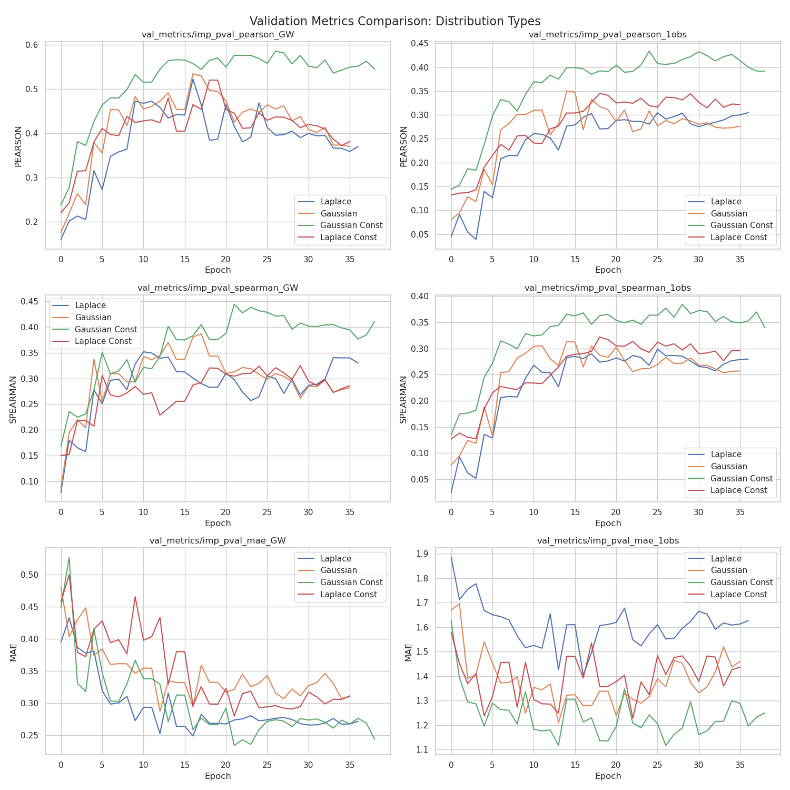
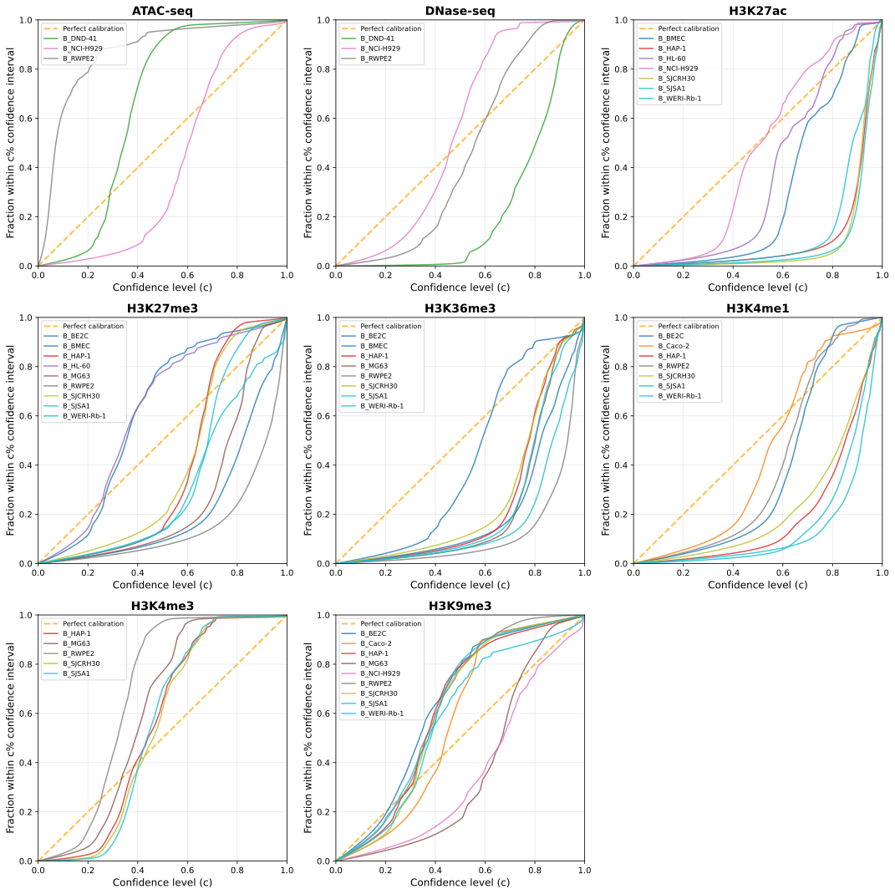
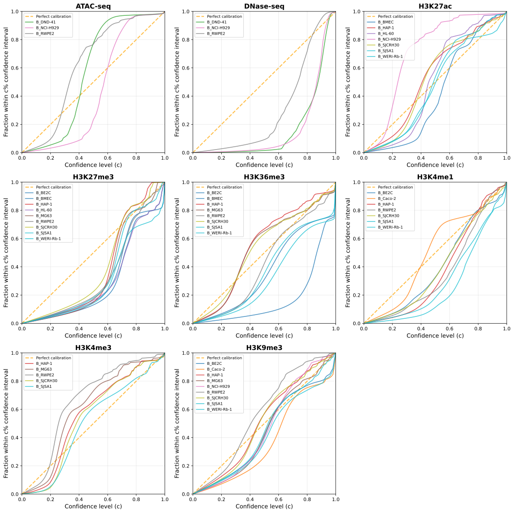

# Probability Distribution Analysis for Signal Prediction Head

This report compares different probability distributions experimented with for the signal prediction head in the CANDI model.

## Models Compared

All models were trained with the following common configuration:
*   **Optimizer**: Adamax (LR=0.001)
*   **Architecture**: 4 SAB layers, 3 CNN layers
*   **Loss weights**: pval=1.0, peak=0.25, obs=0.25, imp=1.0
*   **Context length**: 3072
*   **Num loci**: 5000 (full_chr)

The specific configurations for each model are:

1.  **Laplace** (`models/20260119_180642_CANDI_eic_full_chr_5000loci_Jan19_EIC_chr19_ConfAbl_laplace`)
    *   **Distribution Type**: `laplace`
    *   **Model Parameters**: 52,398,751
    *   **Epochs**: 30

2.  **Gaussian** (`models/20260119_180642_CANDI_eic_full_chr_5000loci_Jan19_EIC_chr19_ConfAbl_gaussian`)
    *   **Distribution Type**: `gaussian`
    *   **Model Parameters**: 52,398,751
    *   **Epochs**: 30

3.  **Gaussian Const** (`models/20260119_180642_CANDI_eic_full_chr_5000loci_Jan19_EIC_chr19_ConfAbl_gaussian_const`)
    *   **Distribution Type**: `gaussian_const` (Constant variance)
    *   **Model Parameters**: 52,397,526 (Slightly fewer params due to constant variance)
    *   **Epochs**: 30

4.  **Laplace Const** (`models/20260119_182302_CANDI_eic_full_chr_5000loci_Jan19_EIC_chr19_ConfAbl_laplace_const`)
    *   **Distribution Type**: `laplace_const` (Constant scale)
    *   **Model Parameters**: 52,397,526 (Slightly fewer params due to constant scale)
    *   **Epochs**: 30

## Validation Results Comparison

The following figures compare the validation performance of the models across different metrics.

### Overall Performance

## Calibration Analysis

The following figures show the calibration analysis for imputed data.

*   **Plot Interpretation**: These plots compare the expected confidence level (x-axis) with the observed fraction of data points falling within that confidence interval (y-axis).
*   **Perfect Calibration**: Represented by the orange diagonal dashed line. If the model is perfectly calibrated, the curves should follow this line.
*   **Curves**: Each curve represents a different biosample within an assay type.
*   **Assay Panels**: The plot is divided into panels for different assay types (e.g., DNase-seq, H3K27ac, etc.).
*   **Under/Over-confidence**:
    *   Curves **below** the diagonal indicate the model is **over-confident** (predicted intervals are too narrow, capturing fewer points than expected).
    *   Curves **above** the diagonal indicate the model is **under-confident** (predicted intervals are too wide, capturing more points than expected).

### Log-Laplace Model

### Log-Normal Model

