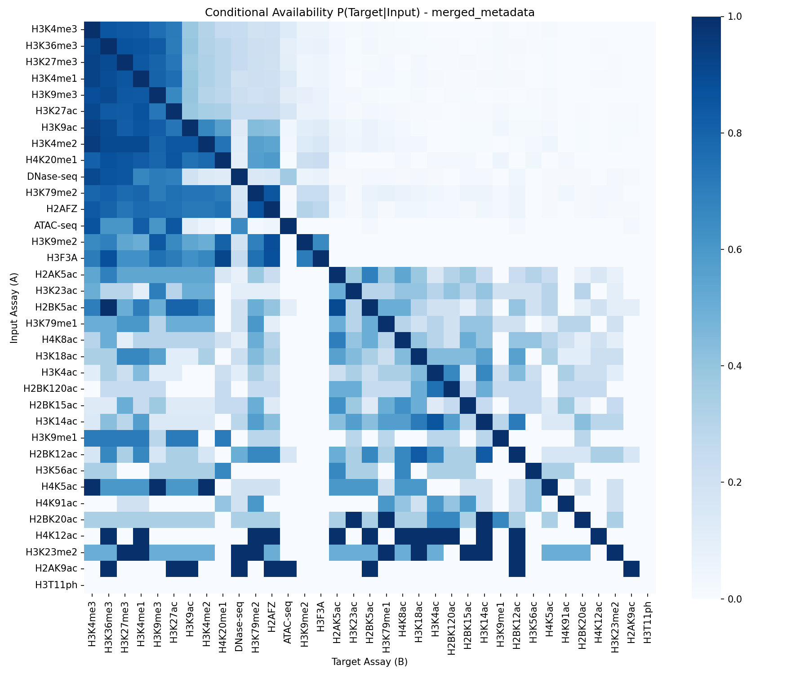
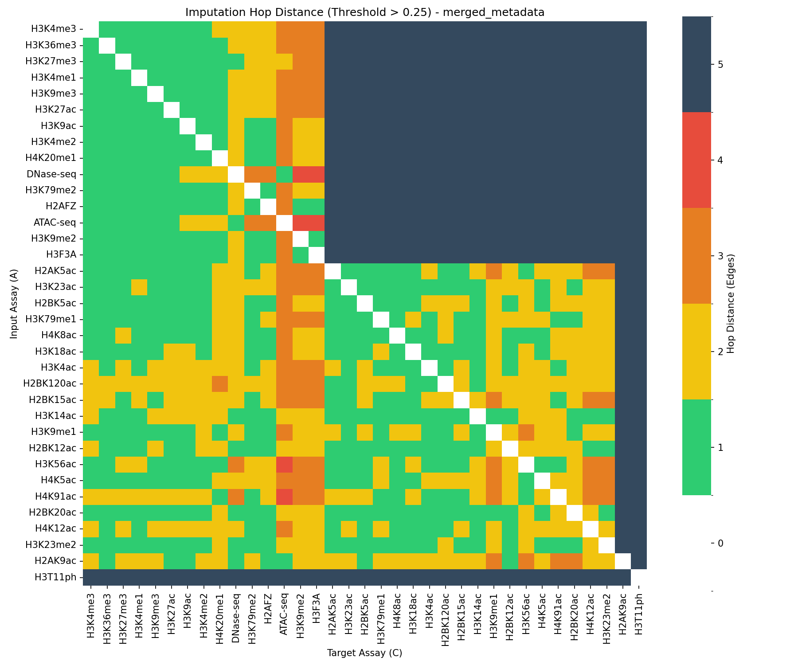
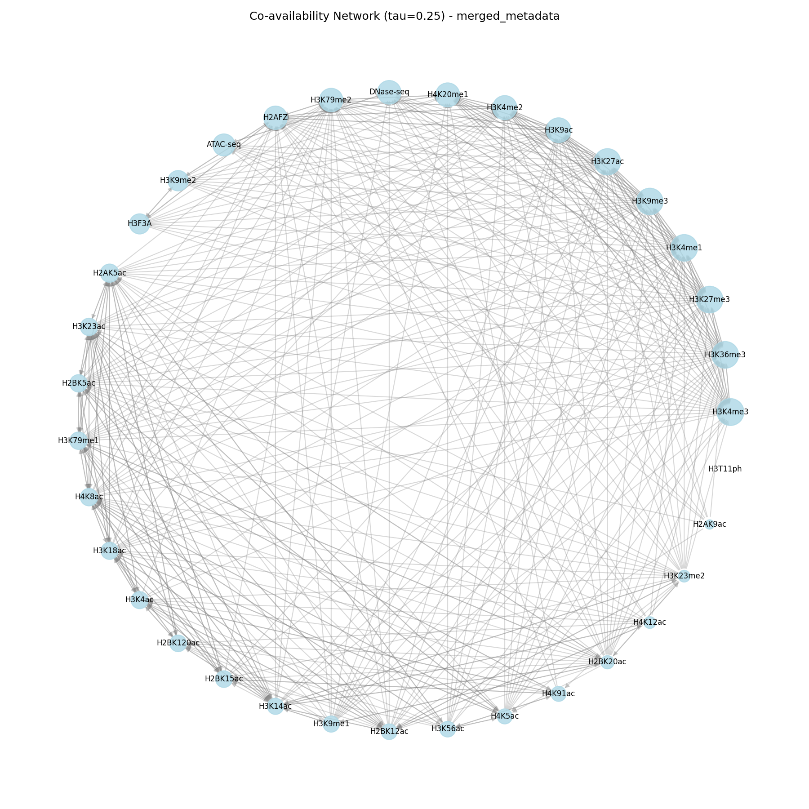

# Co-availability and Imputation Hop Analysis

## 1. Theoretical Formalization

We model the imputation task as traversing a **Directed Co-availability Graph**. If Assay A (input) and Assay C (target) rarely appear together in the same biosample, the model cannot directly learn the mapping $A \to C$. Instead, it must rely on "bridge" assays (e.g., B) that connect them through transitivity ($A \to B \to C$), forcing the model to align their latent representations.

### A. The Probability Matrix (Edge Weights)
We quantify the strength of the direct link between any two assays $i$ and $j$ using the **Conditional Availability Probability** $P(j|i)$.

Let $N(i)$ be the number of biosamples containing assay $i$.
Let $N(i, j)$ be the number of biosamples containing *both* assay $i$ and assay $j$.

$$ P(j|i) = \frac{N(i, j)}{N(i)} $$

*   **Meaning:** Given that Assay $i$ is available (input), what is the probability that Assay $j$ is also available (target or intermediate) in the training set?
*   **Directionality:** This metric is asymmetric ($P(j|i) \neq P(i|j)$).

### B. The Connectivity Graph
We define a directed graph $G = (V, E)$ where:
*   **Nodes ($V$):** The set of all unique assays.
*   **Edges ($E$):** A directed edge $i \to j$ exists if there is "sufficient" co-training signal, defined by a threshold $\tau$.
    $$ \text{Edge } i \to j \iff P(j|i) > \tau $$

### C. The Metric: Imputation Hop Distance (IHD)
The "number of intermediate nodes" required to impute Target $C$ from Input $A$ corresponds to the **Shortest Path Length** on this graph.

$$ \text{Nodes}(A \to C) = \text{ShortestPath}(A, C) - 1 $$

*   **Distance 1 ($A \to C$):** Direct strong co-occurrence. (0 intermediate nodes).
*   **Distance 2 ($A \to B \to C$):** Indirect path. The model likely imputes $B$ implicitly to reach $C$. (1 intermediate node).
*   **Distance $\infty$:** Assays are effectively disconnected at the chosen threshold $\tau$.

---

## 2. Analysis Results (Merged Dataset)

The following analysis was performed on the `merged_metadata.csv` dataset, filtered to the core 35 assays.

### A. Conditional Availability Heatmap
This matrix shows $P(\text{Target} | \text{Input})$. Dark columns indicate assays that are rarely available targets. Dark rows indicate inputs that rarely co-occur with other assays.

### B. Imputation Hop Distance (Threshold $\tau=0.25$)
This matrix shows the number of graph edges required to go from Input to Target, assuming a link requires $>25\%$ conditional probability.
*   **Green (1):** Direct imputation.
*   **Yellow/Orange (2-3):** Indirect imputation.
*   **Red/Dark:** Highly indirect or disconnected.

### C. Co-availability Network Topology (Threshold $\tau=0.25$)
*   **Nodes:** Sized by total availability (Area $\propto$ Count).
*   **Edges:** Directed arrows where Thickness $\propto P(\text{Target}|\text{Input})$. Only edges with $P > 0.25$ are shown.

---

### D. Practical Implications

1.  **Core Connectivity:** The network plot reveals which assays form the "core" training set (large, highly connected nodes) and which are peripheral.
2.  **Imputation Risk:** For pairs with Hop Distance > 2, the model relies on a long chain of inference. These predictions should be flagged as potentially lower confidence or requiring careful validation.
3.  **Dataset Bias:** If certain assay groups (e.g., Histone Marks vs. Transcription Factors) form separate clusters with weak bridges, the model may struggle to generalize across them.
