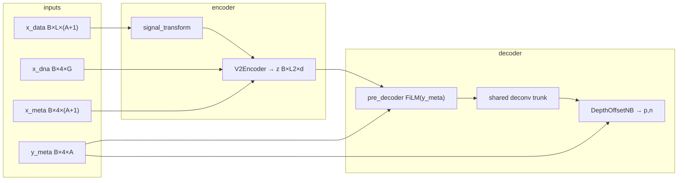

# E32 agent context — CANDI v2 architecture & what you can change

**Read this before editing `train.py`.** Full experiment spec: `sandbox/ideas/autoresearch_may31_r2vscorr_disparity.md`.

This document explains how the **frozen** model works, why certain metrics behave the way they do, what is **immutable** in the E32 loop, and what a future harness (E33+) might expose.

---

## 1. Mental model (one paragraph)

CANDI v2 is an encoder–decoder that maps **raw counts + DNA + metadata** to **Negative Binomial count parameters** `(p, n)` per locus and assay. The encoder sees **input** metadata `x_meta` and masked tracks; the decoder sees **target** metadata `y_meta` (FiLM + depth-offset head). E32 uses the **depth-offset** count head: the network predicts log2 **enrichment** `η`; absolute scale comes from **log2 sequencing depth** in `y_meta` row 0. Wrong depth at eval → R² collapses while Pearson can stay ~0.5 (rank preserved, calibration broken). Your job in E32 is **not** to redesign the trunk; it is to tune **training objective, DSF, loss weights, depth_center, signal_transform, and optional aux losses** in `train_step()`.

---

## 2. Frozen E32 shell (immutable during loop)

Built in `prepare.py` → `build_shell_model()`; **you cannot change this file** during autoresearch.

| Component | E32 value | Source |
|-----------|-----------|--------|
| Model class | `CANDIv2` | `sandbox/candi_v2/model.py` |
| Assays `A` | 8 (`SANDBOX_ASSAYS`) | sandbox HDF5 |
| Context `L` | 768 bins | `build_real_v2_config(context_length=768)` |
| Encoder | 3 conv layers, 2× transformer, `film_mode=per_conv_and_transformer`, `mask_token` | `candi_v2_default.yaml` |
| Decoder trunk | `shared`, 3 deconv layers, `single_pre_decoder` FiLM | yaml |
| Active heads | **`count_only`** (no peak/pval) | `prepare.py` forces `heads="count_only"` |
| Count head | **`depth_offset`** (not `plain`) | `prepare.py` forces this |
| Params | ~0.3M | tiny sandbox preset |
| Train pin | 32 chr19 batches, bs=4, assay-only cloze | `pin_manifest.json` |
| Eval pin | 8 chr21 batches, zero-shot imp, **vb_natural** meta | `eval_pass.py` |
| Steps | 5000 | `prepare.MAX_STEPS` |
| Random seed | 42 (model init + pin manifest) | `prepare.SEED` |

```327:338:sandbox/autoresearch/may31/prepare.py
def build_shell_model(device: torch.device, tc: agent_train.TrainConfig) -> Tuple[CANDIv2, Any]:
    cfg = build_real_v2_config(heads="count_only", lr=tc.lr, clip_norm=tc.clip_norm)
    cfg.decoder.count_head = "depth_offset"
    cfg.decoder.depth_center = float(tc.depth_center)
    cfg.encoder.signal_transform = tc.signal_transform
    cfg.training.loss_weights.obs_weight = tc.obs_weight
    cfg.training.loss_weights.imp_weight = tc.imp_weight
    cfg.training.loss_weights.count_weight = tc.count_weight
    ...
    model = CANDIv2(cfg).to(device)
```

**Not available in E32 (would need E33+ `patch_model` hook):**

- `decoder.grouped_deconv` (per-assay deconv groups)
- `decoder.trunk=separate`, `film_mode=per_deconv_layer`
- `count_head=plain` (direct μ prediction)
- More/fewer transformer or conv layers, wider `d_model`
- Swapping in custom `nn.Module` trees under `sandbox/candi_v2/`

---

## 3. End-to-end forward path



Core composition:

```57:84:sandbox/candi_v2/model.py
    def forward(
        self,
        x_data: torch.Tensor,
        x_dna: torch.Tensor,
        x_meta: torch.Tensor,
        y_meta: torch.Tensor,
        ...
    ) -> Dict[str, Optional[torch.Tensor]]:
        z = self.encoder.encode(x_data, x_dna, x_meta, return_meta=False)
        out = self.decoder(z, y_meta)
        out["z"] = z.detach()
        return out
```

**Critical split:**

- **`x_meta`** — conditions the **encoder** (FiLM on conv + transformer). Cloze/missing slots use sentinels in `x_meta` after masking.
- **`y_meta`** — conditions the **decoder** (pre-decoder FiLM + **depth row for μ**). Training uses true T metadata in `prep["y_meta"]`. Eval imp uses **V/B natural depth** injected in `eval_pass.build_y_meta_vb_natural()` (fixed; not tunable).

---

## 4. Metadata layout (4 rows × A assays)

Same convention as production sandbox H5:

| Row | Meaning | Used by |
|-----|---------|---------|
| 0 | `log2(seq_depth)` | **Depth-offset μ**; DCR probe perturbs this |
| 1 | `assay_id` | Embedding / FiLM |
| 2 | `read_length` | FiLM |
| 3 | `run_type` (0/1) | FiLM |

Sentinels (`sandbox/batch.py`): `MISSING=-1`, `CLOZE=-2`. Depth-offset head **must not** apply `2^(d - center)` to sentinels:

```166:172:sandbox/candi_v2/decoder.py
        valid = (depth_log2 != MISSING) & (depth_log2 != CLOZE)
        d_centered = depth_log2.unsqueeze(1).to(x.dtype) - self.depth_center
        log2_mu_offset = d_centered + eta
        log2_mu_fallback = eta
        log2_mu = torch.where(valid.unsqueeze(1), log2_mu_offset, log2_mu_fallback)
        mu = torch.pow(2.0, log2_mu)
```

**Agent lever:** `TrainConfig.depth_center` (rebuilds model each run). Wrong center → μ scale wrong → **den/imp R²** suffer; DCR may still look OK if depth sensitivity is relative.

**Agent lever (train only):** `y_meta_depth_dropout_p` in `train_step()` zeros depth row before forward — teaches fallback path `μ = 2^η` without offset.

---

## 5. Depth-offset count head (why R² ≠ r²)

The head predicts **η** (log2 enrichment) and **n** (dispersion); **μ** is deterministic from depth:

```119:122:sandbox/candi_v2/decoder.py
        d        = log2(seq_depth)                     # target metadata row 0
        log2_mu  = (d - depth_center) + eta
        mu       = 2^log2_mu
        p        = n / (n + mu)
```

**Eval point prediction** uses NB mean (not Pearson on η):

```116:117:sandbox/eval.py
    nb_mean = output_n * (1.0 - output_p) / (output_p + 1e-8)
```

- **Pearson / Spearman** — rank-friendly; can be ~0.5 when μ is wrong scale but ordering is ok.
- **R²** — `1 - SS_res/SS_tot` on `(nb_mean, y_target)`; punishes **absolute calibration**. This is the E32 primary target after the den gate.

**Do not disable `depth_offset`** in E32 — `prepare.py` always sets it. Plain head would be a different experiment (E33).

---

## 6. Encoder input transform (agent-tunable: D1)

Before conv towers, counts are transformed:

```846:847:sandbox/candi_v2/encoder.py
        x_signal_t = _apply_signal_transform(x_signal.float(), self.cfg.signal_transform)
        x_signal_t, availability = self._prepare_signal(x_signal_t, x_meta)
```

`TrainConfig.signal_transform` → `cfg.encoder.signal_transform` at build time.

| Value | Effect |
|-------|--------|
| `log1p` | Default; compresses dynamic range |
| `arcsinh` | Production-like alternative |
| `none` | Raw counts into conv — may mismatch depth-offset calibration trained on log-scale patterns |

---

## 7. Training vs eval tasks (immutable in `prepare` / `eval_pass`)

| | **Training** | **Eval imp (primary)** | **Eval den** |
|--|--------------|------------------------|--------------|
| Biosample | T_* only | T input, **V/B GT** (`y_data_imp`) | T_* |
| Missing assays | Cloze on T-available (`masked_map`) | **−1 on input**, no cloze | Observed only |
| Target counts | T `y_data` on masked slots | V/B `y_data_imp` on `y_avail==0` | T `y_data` on observed |
| `y_meta` at decode | T true meta (`prep["y_meta"]`) | **V/B natural** (`y_meta_imp`) | T meta (+ vb_natural path) |
| DSF | `TrainConfig.dsf_sampling` | **Forced dsf=1** on eval batches | dsf=1 |
| Loss masks | `observed_map` / `masked_map` from cloze | N/A (metrics only) | `observed_map` |

Train cloze (fixed masker in `prepare.py`):

```python
make_masker(p_full_assay=1.0, p_full_loci=0.0, p_chunks=0.0)  # assay-only
```

Eval imp metadata (fixed — **A1 fix**):

```52:76:sandbox/autoresearch/may31/eval_pass.py
def build_y_meta_vb_natural(...):
    y_meta_fwd = prep["y_meta"].clone()
    missing = (y_avail == 0).unsqueeze(1).expand_as(y_meta_fwd)
    ...
    y_meta_fwd[use_vb] = ymi[use_vb]   # V/B depth/readlen/runtype
```

Diagnostic `imp_count_r2_gw_canonical` deliberately uses wrong median depth — should stay much worse than vb_natural (baseline: vb ≈ −2.7, canonical ≈ −9.2).

---

## 8. Loss (what `train_step` controls)

Default path (`train.py`):

```114:124:sandbox/autoresearch/may31/train.py
    p, n, mu, var, df, peak = model.forward_tuple(...)
    loss, stats, _terms = base_loss_fn.forward_with_terms(
        p, n, mu, var, df, peak,
        prep["y_data"], prep["y_pval"], prep["y_peaks"],
        prep["observed_map"], prep["masked_map"],
        ...
        fallback_imp_to_observed_when_no_masked=False,
    )
```

`build_v2_loss` wraps production `CANDI_LOSS` with weights from config:

- **`obs_weight`** — denoising branch on **observed** cloze positions (full-depth T tracks).
- **`imp_weight`** — imputation branch on **masked** cloze positions (still T biosample).
- **`count_weight`** — global count NLL scale.

E32 sets `fallback_imp_to_observed_when_no_masked=False` so imp loss is only on truly masked bins.

**Agent extensions in `train_step()` (already stubbed):**

- `lambda_mse_obs` / `lambda_mse_imp` — direct MSE on `nb_mean` vs `y_data` (B1/B3). Helps **R²** more than NLL alone.
- `mse_on_log1p` — heavy-tail stable variant.

**Important:** Training imp loss uses **T** counts on masked assays, but primary eval imp R² uses **V/B** counts on T-missing assays. Improving train imp NLL does not guarantee vb imp R² ↑ — alignment axes: depth prompt, calibration, DSF.

---

## 9. Metrics & gated primary (immutable logic in `prepare`)

| Metric | Meaning |
|--------|---------|
| `den_count_r2_gw` | R²(nb_mean, T `y_data`) on **observed** positions, eval dsf=1 |
| `imp_count_r2_gw` | R²(nb_mean, V/B `y_data_imp`) on **T-missing** positions, vb meta |
| `depth_count_ratio` | Σμ(depth=24) / Σμ(depth=22) on query bins; target **≈ 4** |
| `imp_count_pearson_gw` | Rank metric; guard-rail in imp phase |
| `primary_score` | If den≥0.35 and DCR∈[3.25,4.75]: `imp_r2 + 1`; else `den_r2 - 0.35` |

Baseline row 0 (random init, 5k steps): den_r2 ≈ −1.8, DCR ≈ 4.0, metric_phase=**den**. DCR≈4 means the **architecture reads depth**; den_r2 negative means **calibration/objective** not yet learned.

---

## 10. What you CAN change (`train.py` only)

| Knob | Rebuilds model? | Typical use |
|------|-----------------|-------------|
| `depth_center` | Yes | Align offset with sandbox depth distribution (~27) |
| `signal_transform` | Yes | Encoder/count scale alignment (D1) |
| `obs_weight`, `imp_weight`, `count_weight` | Yes (loss only) | Den phase: ↑obs, ↓imp; imp phase: tune imp |
| `dsf_sampling` `uniform`/`off` | No (batch pin sampling at load) | `off` for identity-like den |
| `lr`, `optimizer`, `clip_norm` | Yes / opt | Stability |
| `lambda_mse_*`, `mse_on_log1p` | No | Direct R² pressure (B1/B3) |
| `y_meta_depth_dropout_p` | No | Robustness (D3) |
| Custom code in `train_step` | No | Post-hoc affine on `nb_mean` (D4) — add params + extend `build_optimizer()` |

**Cannot do in E32 without harness change:**

- Replace decoder trunk or add groupwise deconv (`DecoderConfig.grouped_deconv=True`)
- Change `n_transformer_layers`, `film_mode`, or head type
- Call `patch_model()` — **not wired** (May28 diagnostics had `patch_count_head`; E32 does not)

### D4 pattern (allowed in `train.py`)

Learnable per-assay scale/bias **after** forward, only in `train_step`:

```python
# Example sketch — agent implements
_calib_a = nn.Parameter(torch.ones(8))
_calib_b = nn.Parameter(torch.zeros(8))
# after nb_mean = n*(1-p)/p: nb_mean = nb_mean * _calib_a + _calib_b
# include _calib_* in build_optimizer() param groups
```

Eval still uses raw model forward in `eval_pass` — **D4 in train_step only affects training unless you also wrap forward for eval** (eval uses `prepare` loop, not `train_step`). **Limitation:** post-hoc calib in `train_step` alone does **not** change eval metrics unless you add an eval wrapper in `prepare.py` (frozen). For E32, D4 only helps if you modify loss on calibrated preds during train and the model internalizes it — prefer `lambda_mse_*` on raw `nb_mean` instead.

---

## 11. Suggested experiment order (E32)

1. **Den phase:** `dsf_sampling="off"`, `obs_weight=2–4`, `imp_weight=0.25–0.5`, tune `depth_center` ∈ [25, 28].
2. Once `den_count_r2_gw` → 0.2+, push `lambda_mse_obs`, then `lambda_mse_imp`.
3. **Imp phase** (after gate): increase `imp_weight`, add `lambda_mse_imp`, try small `y_meta_depth_dropout_p`.
4. Avoid huge VRAM additions; cap 9500 MB.

---

## 12. E33+ harness ideas (for humans — not actionable in E32)

If E32 plateaus, next autoresearch generation should expose **architecture hooks** without editing `sandbox/candi_v2/`:

```python
# prepare.py (one-time human wiring)
model = CANDIv2(cfg).to(device)
model = agent_train.patch_model(model, tc)   # NEW
```

| Hook | Config / API | Hypothesis |
|------|----------------|------------|
| `patch_model` | Agent replaces NB layer or wraps decoder | D2 groupwise scale |
| `DecoderConfig.grouped_deconv` | bool in TrainConfig | Per-assay deconv |
| `count_head` | `plain` vs `depth_offset` | When depth prompt unreliable |
| `decoder.film_mode` | `per_deconv_layer` | Stronger metadata routing |
| Eval calib wrapper | `eval_pass` calls `agent_train.calibrate_preds(mu)` | D4 at eval time |
| `patch_model` + param cap | Reject if params > baseline + δ | VRAM fairness |

Document in `sandbox/ideas/autoresearch_e33_*.md` which tier failed in E32 (`results.tsv` + synthesis) before enabling structural search.

---

## 13. Quick reference — files

| File | Role | Agent edits? |
|------|------|--------------|
| `train.py` | Config + `train_step` + `build_optimizer` | **YES** |
| `prepare.py` | Build model, train loop, primary score | **NO** |
| `eval_pass.py` | vb/canonical/cloze eval | **NO** |
| `pin_manifest.json` | Data pin | **NO** |
| `sandbox/candi_v2/*` | Model implementation | **NO** (read-only) |
| `program.md` | Loop rules | Read only |

---

## 14. Copy-paste for parent agent prompt

Add to your autoresearch prompt:

> Read `sandbox/autoresearch/may31/AGENT_ARCHITECTURE_CONTEXT.md` before editing `train.py`. Respect frozen depth_offset shell; optimize den R² via weights/DSF/depth_center/MSE aux; remember imp eval uses V/B metadata and counts — not the same as train cloze targets.
