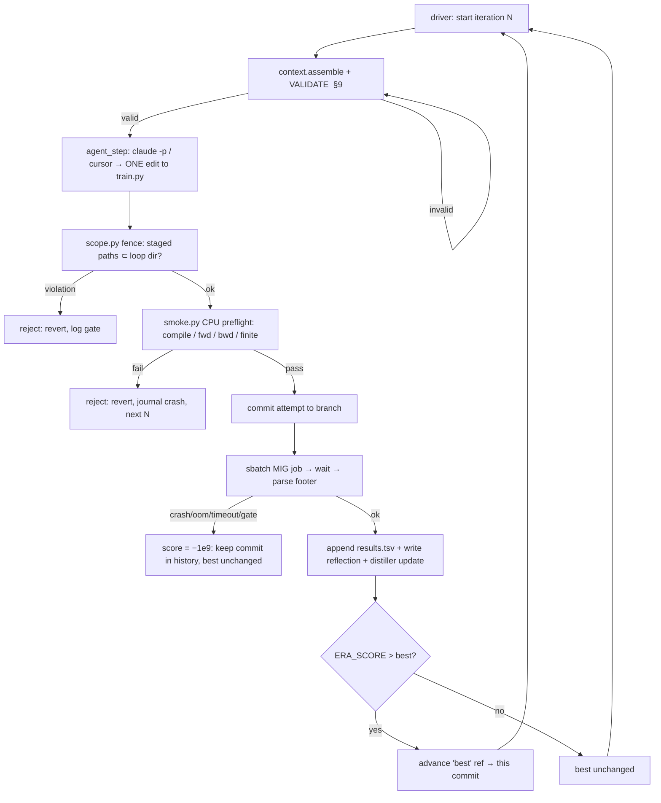

# CANDI v3 — Menu Autoresearch: Design & Implementation Plan

**Status:** plan (pre-implementation). Permanent record for this harness. Lives inside the AR dir
per the self-containment rule. Nothing in this project is ever written, promoted, or merged
outside `sandbox/autoresearch/menu/`.

---

## 0. TL;DR

Five **independent, concurrent, stateless greedy-ratchet** autoresearch loops, each seeded from
**candi_v2 as-is**, each committed to **one unexplored axis of the CANDI v3 design menu**, all
scored by the **same frozen ERA judge** (vendored, chr19→chr21, fixed wall-clock), supervised by
**one thin read-only orchestrator**, monitored by **one unified HTML dashboard**. Traversal of the
menu = the *portfolio of five loops*, not one wandering loop.

This exists because the ERA/FUTS run **collapsed into a monoculture**: of 281 nodes, 213 had a
single visit, and **all 82 nodes scoring > −0.05 descended from one early node** (the cross-assay
set-transformer). PUCT's rich-get-richer dynamics + an undertrained-budget snapshot buried every
structurally-different design. AR with one greedy loop *per design* sidesteps that: each loop
hill-climbs **within** its committed family and cannot drift back into the exploited CF basin.

---

## 1. The five loops

Each loop's **row-0 is unmodified candi_v2**; the agent's **first edit implements the thesis**,
and every subsequent edit is a surgical improvement *within that thesis*. ERA's already-exploited
findings are **never re-derived by trial** — they are handed to each agent as written *priors*
(menu §3.5/§3.6) it may apply cheaply along its own axis.

| tag | thesis (one line) | menu axis attacked | why it's unexplored / distinct from the CF basin |
|---|---|---|---|
| `single_lambda` | one depth-free latent enrichment field `λ(assay,pos)` is the only learned quantity; `NB(λ·sf, φ)` the only likelihood; **pval and peaks are deterministic transforms of the λ posterior**, not separate heads | §3 Targets & likelihood; "fewer heads" | **Never built.** Every ERA node (incl. best) kept `head_mu`+`head_r`+`head_sig`+peak independent. Collapsing them **dissolves the unsolved ECE wall by construction** — calibrate λ once, all views calibrated — killing the ~40 late ERA nodes that fought NB calibration with band-aids. |
| `axial_longrange` | replace per-position cross-assay attention with **axial attention over (assay × position)** + a memory-efficient dilated/hierarchical long-range position mixer (TAD / enhancer–promoter scale) | §3 "assays as tokens / axial"; "longer memory-efficient context" | The **only genuinely different backbone** ERA tried (nodes 1,3,6,7), pruned purely as a ~2.3-epoch **budget artifact** and never revisited. The CF spine only ever did per-position attention + a small conv; long-range context was bolted on late as cheap avg-pools. |
| `factorized` | model the data as **explicit low-rank embeddings** — cell-type × assay × multi-resolution-position factors — combined by a small DNA-conditioned net, *not* attention | §3.6b low-rank tensor factorization (Avocado) | Menu states verbatim ERA "used attention-based borrowing, **never explicit factorization**." Natively expresses the avg-reference+deviation decomposition and gives cheap long-range via coarse position factors. |
| `crps_calibration` | replace the NB + second-moment band-aids with a **calibrated-by-design distributional output** (quantile regression / CRPS loss) | §3 "explicit calibration objective (coverage / CRPS)" | Attacks the still-**unsolved** ECE wall from the *likelihood* side. ERA only ever did NB PIT / variance patches on top of a fixed NB; never a different distributional head. |
| `repr_first` | a **strong latent Z** + light readout heads + **light latent regularization** (Gaussian prior+ELBO or SIGReg per constraint 5) | §3 "representation-first"; constraint 5 | Barely touched (deprioritized "only if dead-ends" — we are at one). Latent Z is CANDI's strongest RNA-seq predictor. **Still optimizes the frozen S_A** (hypothesis: regularized latent → better held-out generalization); latent quality is a **logged diagnostic, never the ratchet key**. |

---

## 2. Hard rules (non-negotiable)

1. **Self-contained.** All code, history, results, journals, design doc, and synthesis live under
   `sandbox/autoresearch/menu/`. **Never touch, write, promote, or merge anything outside it** —
   not candi_v2, not candi_v3, not production, not `sandbox/ideas/`, not META/EXPERIMENTS.
2. **Frozen judge.** The vendored ERA eval/score/data/baselines/constants are the immutable
   yardstick — **identical across all five loops**, never edited mid-run. This is the
   `prepare.py`-equivalent.
3. **One file per iteration.** The agent edits only its loop's `train.py`. One surgical change per
   iteration (clean attribution).
4. **Budget is fixed and shared.** `min(5 epoch, 1800 s)` wall-clock (the harness owns it; a
   candidate cannot extend it). Same for all loops → cross-loop comparability.
5. **Per-loop isolation.** Separate working dir, branch, tmux, results, journal. No shared mutable
   state. One loop crashing/looping never disturbs another.
6. **No promotion.** The AR's only outputs are the per-loop winning `train.py` + history + journals
   + `SYNTHESIS.md`, all inside the AR dir.

The ERA §2 HARD CONSTRAINTS still bind every candidate (native DNA tower, memory-efficient
context, control-optional, fixed decoder first, light latent reg only, covariate semantics).

---

## 3. Directory layout

```
sandbox/autoresearch/menu/
  DESIGN_DOC.md                 # this file
  SYNTHESIS.md                  # written on global stop (inside the dir)
  dashboard.html                # regenerated every REFRESH s (no server)

  _judge/                       # VENDORED, FROZEN, read-only to all loops (the yardstick)
    eval_v3.py  score.py  harness.py  data_v3.py
    baselines/marginal.py  constants_frozen.yaml
  _adapter/
    candi_v2_model.py           # candi_v2 wrapped into the Model contract (read-only base)
    train_v2_row0.py            # the row-0 train.py every loop starts from
  _harness/                     # SHARED loop machinery (read-only to agents)
    driver.py                   # per-loop stateless ratchet runner (NEVER STOP lives here)
    agent_step.py               # assembles context, invokes claude -p / cursor, applies edit
    context.py                  # the context bundle + its validators (§9)
    distiller.py                # rolling lessons + backlog compression
    smoke.py                    # CPU preflight gate (reused from ERA)
    scope.py                    # staged-path fence (reject anything outside the loop dir)
    sbatch_wrap.sh              # submit one MIG-slice job, poll, return footer
    selftest.py                 # G0–G3 automated assertions
  _orchestrator/
    orchestrator.py             # thin read-only supervisor (watchdog + arbiter + dashboard + synth)
    dashboard.py                # renders dashboard.html from all loops' artifacts

  single_lambda/                # ── per-loop, MUTABLE, own git branch + tmux ──
    program.md                  # the loop's thesis + priors + keep-rule (agent-facing)
    train.py                    # the file the agent edits (row-0 = candi_v2 adapter)
    results.tsv                 # one row per iteration (schema §10)
    reflections.md              # per-iteration reasoning journal (schema §10)
    backlog.md                  # parked ideas, distilled (schema §10)
    run.log                     # latest run stdout (gitignored; tail-only into context)
    runs/                       # per-iteration sbatch workdirs / footers
  axial_longrange/   factorized/   crps_calibration/   repr_first/     # identical structure
```

**Shared (read-only, vendored once) vs per-loop (mutable):**

| shared / frozen | per-loop / mutable |
|---|---|
| `_judge/*` (eval, score, harness, data, baselines, constants) | `train.py` (the agent's edits) |
| `_adapter/*` (candi_v2 base + row-0) | `results.tsv`, `reflections.md`, `backlog.md`, `run.log`, `runs/` |
| `_harness/*` (driver, agent_step, context, distiller, smoke, scope, selftest) | git branch `autoresearch/menu-<tag>` (own worktree) |
| `_orchestrator/*` (supervisor + dashboard) | tmux session `menu-<tag>` |
| data `sandbox.h5` (chr19/chr21), candi_v2 source — read-only | the `best` git ref (current champion) |

The shared infra lives **outside** every loop subdir, so `scope.py` makes it physically
unwritable by any agent: a loop may only stage paths under its own `menu/<tag>/`.

---

## 4. The frozen judge (vendored from ERA)

A one-time, verified copy of the ERA judge into `_judge/`. **Validated at G0 to reproduce ERA's
numbers exactly** (so vendoring introduced no drift).

- **Entrypoint:** `harness.run_and_score(build_model, objective)` → float `ERA_SCORE`.
- **Model contract:** `forward(x_counts, x_avail, x_mask, x_meta, x_dna, control, ctrl_avail,
  y_meta, query_mask)` → `{"count_dist": Distribution over counts [B,L,F], "signal_pred":
  Tensor[B,L,F], "peak_prob": Tensor[B,L,F] | None}`. `L=768`, `F=8`.
- **Objective contract:** `corrupt(batch, rng)` (clean batch → 9 inputs + derived targets/masks),
  `loss(out, cb)` → scalar, `configure_optimizer(params)` → optimizer.
- **Budget:** `min(MAX_EPOCHS=5, T_MAX_SEC=1800)`; SLURM time-limit is the backstop.
- **Data:** chr19 train / chr21 eval (no leakage). Unchanged from ERA → ERA's frozen baselines and
  281-node history remain directly comparable.
- **Metric (frozen, METRIC.md):**
  ```
  Q_imp = mean(imp_{pval,count}×{spearman,pearson})        # held-out V/B on chr21
  Q_den = mean(den_{pval,count}×{spearman,pearson})        # low→high depth on observed T_
  S_A   = Q_imp − 0.485732                                 # PRIMARY (single maximand)
  ERA_SCORE = S_A
            − 0.5 ·max(0, Q_imp − Q_den)                   # denoising ≥ imputation gate
            + 0.4 ·min(0, 0.073369 − ECE)                  # calibration floor (count PIT/ECE)
            + 0.4 ·min(0, c_index − 0.498544)              # uncertainty-discrimination floor
            + 0.4 ·min(0, peak_auroc − 0.716064)           # peak floor (held-out V/B)
            + 0.02·(min(0,DCR−3)+min(0,5−DCR))             # depth band [3,5]
            + (−1e9 if structurally degenerate)
  ```
  **Baseline ERA_SCORE = −0.040** (marginal predictor; only the DCR band fails). The **ECE term is
  orthogonal to the chr19 overfit ceiling** — cracking it is a real, recordable win even at the
  same Q_imp.
- **Degeneracy gates → −1e9:** non-finite train loss, non-finite eval output, constant/near-constant
  `signal_pred` (collapse), OOM/timeout, forbidden import, scope violation.
- **Footer parsed every run** (printed by the harness):
  `ERA_SCORE: <float>` and `ERA_ASPECTS: {S_A, den_pen, cal_pen, cidx_pen, peak_pen, dcr_pen,
  Q_imp, Q_den, ece, c_index, peak_auroc, dcr, imp_pval_spearman, imp_pval_pearson,
  imp_count_spearman, imp_count_pearson, n_imp}`.

---

## 5. candi_v2 → judge adapter (row-0)

candi_v2's native interface does not satisfy the v3 Model/Objective contract. `_adapter/`
provides a thin, frozen wrapper (written once at setup, validated at **G1**):

- `candi_v2_model.py` — wraps candi_v2's encoder/decoder so `forward(9 inputs)` returns
  `{count_dist, signal_pred, peak_prob}`.
- `train_v2_row0.py` — the row-0 `train.py`: defines `Model`/`Objective` over candi_v2, derives
  targets from the clean batch (per the contract), and calls `run_and_score`. This **identical
  file is each loop's iteration-0** → all five loops share one origin score (the v2 anchor on the
  dashboard).

The adapter is read-only base; agents copy it into their `train.py` and evolve from there.

---

## 6. Per-loop ratchet (stateless) — iteration flow + git model

Each loop is driven by `_harness/driver.py` running in its own tmux. **"NEVER STOP" is a property
of the driver loop, not a prompt clause** — the driver keeps spawning stateless agent steps until
you / the orchestrator halt it. Each step is a fresh `claude -p` (or cursor) invocation that holds
no memory beyond the curated context bundle (§9).



**Git model — preserves exact history of every attempt (your requirement).**
- Each loop is a **git worktree** on branch `autoresearch/menu-<tag>` (shared object store, separate
  working dir → 5 loops commit concurrently with zero interference).
- **Every attempt commits** (keep *and* reject), so `git log` / `git show` / `git diff` expose the
  **exact code change of every prior iteration**, including failures.
- The current champion is a **`best` ref/tag**, not HEAD. **Keep** advances `best`; **reject**
  leaves `best` where it is but the rejected commit stays in history. The next iteration's working
  `train.py` is a checkout of `best`.
- The agent (§9) is given **read access to `git log`/`git show`/`git diff` on its own branch** so it
  can inspect precisely what was changed and what it scored — never another loop's history.

*(Decision to confirm — §20: git worktrees off the main repo vs. a per-loop nested `git init`. Both
satisfy concurrency + agent git access + self-containment; worktrees keep history in the main repo,
nested repos are more isolated.)*

---

## 7. ★ Stateless context contract + validation (load-bearing)

Stateless ≠ memoryless. The agent's "memory" is **externalized to durable, curated, validated
artifacts**, reconstructed and **strictly validated** at every step *before* a token is spent.
Done well this **beats** a persistent agent: a persistent context monotonically bloats with stale
reasoning and failed attempts (the very rot that breeds monoculture drift); a curated context
actively fights it, survives crashes/session-limits, and is human-inspectable.

### 7.1 What goes into the step-N context bundle

`context.assemble(loop)` produces a bundle with exactly these fields:

1. **`program.md`** — the loop's fixed thesis, the menu priors it may use, the keep-rule, the
   simplicity criterion, dead-ends to avoid. (Static.)
2. **Current-best `train.py`** — the full file at the `best` ref (the file to beat), with its
   `ERA_SCORE`.
3. **Full `results.tsv`** — every prior iteration: change summary, score, Δ-vs-best, keep/reset/crash.
   (Compact: one line/iter; the complete outcome memory.)
4. **Git lineage of *this* loop** — `git log --oneline` of the branch **plus on-demand
   `git show <commit>` / `git diff <a> <b>`** so the agent can read the **exact diff** of any prior
   attempt (kept or failed). Provided as a tool/affordance, scoped to the loop's branch only.
5. **Last K reflections verbatim** (default K=8) — the live reasoning thread (hypothesis → result →
   interpretation).
6. **Distilled rolling summary** — `backlog.md`: compressed "lessons so far" + the **parked-ideas
   backlog**, so old threads aren't lost but aren't dumped raw.
7. **Last `run.log` tail** (on the previous iteration only, for crash diagnosis).

**Explicitly excluded** (validated *out*): any other loop's files; any `_judge/` internals, chr21
targets, or eval code (the agent must never see the held-out truth — no eval overfitting); raw
full history beyond K (it goes through the distiller).

### 7.2 Validation assertions (the bundle is rejected and rebuilt if any fail)

`context.validate(bundle)` runs **before** every agent call. All must pass:

- **Completeness:** every required field present and non-empty (after iter 0).
- **Provenance / freshness:** `train.py` in the bundle byte-matches `git show best:train.py`;
  `results.tsv` row count == iterations committed; the distilled summary's `updated_at_iter` ==
  N−1 (the distiller ran last step); reflections count == iterations.
- **Schema:** `results.tsv` has the exact column set (§10); each of the last-K reflections has all
  required fields (hypothesis, rationale, expected, result, interpretation, parked).
- **Git access live:** `git log` on the branch returns ≥ N commits; a probe `git show best:train.py`
  succeeds (the agent's diff affordance actually works).
- **Isolation / no-leakage:** no path in the bundle resolves outside `menu/<tag>/` except
  `program.md`'s static priors; **zero** `_judge/`, chr21, or sibling-loop content present
  (hard assert — a leak fails the build).
- **Token budget:** assembled tokens ≤ cap. If `results.tsv` + reflections exceed cap, the distiller
  compresses older entries; **last-K reflections + backlog are preserved verbatim** (asserted), only
  the *older* tail is summarized. A bundle that can't fit even after distillation is a flagged error
  (orchestrator → you), not a silent truncation.
- **Determinism probe:** `assemble` is pure w.r.t. the on-disk artifacts — running it twice yields
  an identical bundle (guards against races with the dashboard reader).

These assertions are unit-tested in `selftest.py` (G4) against synthetic loop states, including the
adversarial cases: a stale `train.py`, a missing reflection, an injected sibling-loop path, an
over-cap history, a corrupt `results.tsv` row. **A validator that never rejects is worthless** — the
tests assert it rejects each bad case.

---

## 8. Journals & results schema

**`results.tsv`** (one row per iteration; gitignored; the dashboard + context both read it):
```
iter  ts  commit  parent  status  era_score  d_best  S_A  Q_imp  Q_den  ece  dcr  c_index
peak_auroc  imp_pval_sp  imp_pval_pe  imp_count_sp  imp_count_pe  steps  epochs  sec  vram_mb
smoke  change_summary
```
`status ∈ {keep, reset, crash, gate}`. Columns after `era_score` come straight from the
`ERA_ASPECTS:` footer.

**`reflections.md`** (append-only; one block per iteration):
```
## iter N · <status> · era_score <v> (Δbest <d>)
- hypothesis:    <the one change and the bet>
- rationale:     <why, citing a prior/result/menu item>
- expected:      <predicted effect on which metric>
- result:        <what the footer showed>
- interpretation:<kept/rejected and why; what it implies>
- parked:        <ideas spun off, not pursued now>
```

**`backlog.md`** (distiller-maintained; overwritten each step): `updated_at_iter`, a bulleted
**lessons-so-far** (compressed older history), and the **parked-ideas** list (deduped, prioritized).

---

## 9. Menu-context policy (anti-rediscovery + anti-recollapse)

Each loop's `program.md` includes: §2 HARD CONSTRAINTS, §4 scoring contract, **§3.5 proven priors,
§3.6 literature priors, the known-dead-ends list** (so ERA's findings come free as *knowledge*, no
GPU spent re-deriving them) — and **only its own §3 thesis**. The **rival §3 directions are
withheld** (showing the full menu is exactly what lets a greedy agent drift back into CF/attention
and re-collapse the monoculture).

---

## 10. Preflight, scope, SLURM, failover

- **Smoke preflight (`_harness/smoke.py`, reused from ERA):** CPU, tiny batch — compiles, runs
  forward+backward, produces a finite non-degenerate score. Gates every edit **before** a GPU job.
  *Caveat (from memory):* CPU-only → misses CUDA-specific bugs; watch the `.smoke_batch.pt` cache
  (delete on any h5 re-bake).
- **Scope fence (`_harness/scope.py`):** rejects any staged path outside `menu/<tag>/`. Tested at G3
  with a deliberate out-of-dir edit.
- **SLURM:** the driver runs on the **login node**; each iteration submits **one** MIG-slice job —
  `--gres=gpu:nvidia_h100_80gb_hbm3_1g.10gb:1` (hard constraint) — polls to completion, parses the
  footer. **≤ 1 in-flight job per loop ⇒ ≤ 5 concurrent** (ERA's proven `batch_size=5`).
- **Cursor failover:** each agent step is an independent headless call, so `claude -p` → on
  session-limit/failure `cursor-agent -p`. **Safer here than in ERA:** the ratchet self-corrects — a
  weaker cursor edit that doesn't beat `best` is simply not adopted, never a quality regression.
  Beats idling a held GPU allocation waiting for a session reset.

---

## 11. The orchestrator (thin, read-only supervisor)

`_orchestrator/orchestrator.py` — **not an LLM agent.** One deterministic Python process on the
login node, polling all five loops' artifacts. **Zero write access to any `train.py`, the judge, or
production code; no model calls; no steering.** Duties:

1. **Watchdog** — restart a dead driver/tmux; `scancel` orphaned jobs (directly mitigates the
   login-node-kill + fork-bomb hazards from memory).
2. **GPU-budget arbiter** — enforce the ≤ 5 concurrent in-flight cap across loops.
3. **Dashboard backend** — aggregate every `results.tsv` + journals into `dashboard.html`.
4. **Plateau detector** — flag a loop with no `keep` in K iters **to you** (writes a flag; never
   acts).
5. **Synthesis** — on global stop, write `SYNTHESIS.md` (per-loop winners, what each axis proved,
   whether any cracked ECE) inside the AR dir.

Distinct from the per-loop **driver** (which spawns agent steps for one loop); the orchestrator only
supervises the five drivers. **You own the global stop** (manual, or a wall-clock cap mindful of the
~11 h login-node kill).

---

## 12. Dashboard / GUI

Self-contained auto-refreshing `dashboard.html` (meta-refresh, no server), regenerated every
REFRESH s by `_orchestrator/dashboard.py`. Theme matches ERA (dark navy `#070b18`; cyan/magenta/
green/amber/violet accents; mono; neon gradients). Finalized layout (see the approved mock):

1. **Header** — global status, elapsed wall-clock, total iters, GPU in-flight X/5, refresh clock.
2. **Reference strip** — **baseline and candi_v2 side-by-side**, full metric breakdown each; v2 is
   the **common origin of all five loops**.
3. **The race** — horizontal best-ERA_SCORE bars per loop, with `baseline −0.040` (floor) and
   `v2` (origin) reference lines.
4. **Loops table** — thesis, best, Δbase, Δv2, iters, keeps, **ECE ✓/✗**, DCR, last status, in-flight.
5. **Trajectory** — best-ERA_SCORE vs iteration, 5 lines + baseline/v2 reference lines.
6. **Per-loop progress (ERA-style)** — one box per loop: **per-variant dots** (every scored
   attempt; rejects dip below) + a glowing **running-best staircase** in the loop's color + dashed
   `baseline` / `v2` reference lines. Ported from the candi_v3 ERA dashboard's "ERA_SCORE progress —
   running best · per-variant dots."
7. **Score components** — per loop: S_A, the 4 imp correlations, Q_imp/Q_den, ECE (red over floor),
   DCR, AUROC; repr_first's latent diagnostics shown as a footnote, **not scored**.
8. **Loop detail (expandable)** — the **stateless memory made visible**: recent `results.tsv`,
   the reflection journal, the parked-ideas backlog.
9. **Orchestrator panel** — watchdog, GPU arbiter, orphaned-job scancels, driver restarts,
   plateau flags → you, scope-violations-blocked, synthesis status.

---

## 13. Pre-launch validation gates (I drive these; iterate harness code until each is green)

Deterministic, gated, **no agent search begins until all green**.

| gate | check | pass criterion |
|---|---|---|
| **G0 — judge parity** | run `baselines/marginal` through the *vendored* judge | reproduces ERA constants exactly (`Q_imp_base 0.4857`, `τ_cal 0.0734`, baseline ERA_SCORE −0.040) |
| **G1 — adapter** | candi_v2 row-0 end-to-end under the fixed budget | finite non-degenerate `ERA_SCORE`, DCR in band, footer parses, no crash → this is the v2 anchor |
| **G2 — smoke (both ways)** | smoke on the valid adapter **and** on deliberately-broken candidates | PASSES valid; FAILS bad-shape / non-finite / syntax-error |
| **G3 — scope fence** | stage an edit outside the loop dir | blocked |
| **G4 — context contract** | `selftest.py` over §7.2 assertions + adversarial bad bundles; one observed 3-iteration agent run | every assertion fires correctly; Δ/keep/reset correct; next step's bundle contains prior history + working git diff |
| **G5 — concurrency + watchdog** | 2 loops (not 5) in tmux | no cross-contamination; orchestrator recovers a killed tmux + `scancel`s an orphan; GPU cap holds |
| **G6 — dashboard** | render from the 2 live loops | aggregates correctly vs baseline + v2; auto-refreshes |

G0–G3 are codified in `selftest.py` (re-run on every harness change). G4 adds the context-contract
suite. G5–G6 are observed runs.

---

## 14. Operation runbook

1. **Setup:** vendor `_judge/`; build `_adapter/`; write `_harness/`, `_orchestrator/`, the five
   `program.md`. Create 5 worktrees + tmux.
2. **Validate:** run G0–G6; fix harness until green.
3. **Baseline:** row-0 (candi_v2 adapter) recorded as iter-0 in each loop → the v2 anchor.
4. **Launch:** start 5 drivers (one per tmux); start the orchestrator (own tmux); open
   `dashboard.html`.
5. **Monitor:** dashboard + plateau flags. The orchestrator self-heals crashes/orphans.
6. **Stop:** you halt the drivers (manual or wall-clock cap < ~11 h). Orchestrator writes
   `SYNTHESIS.md`.
7. **Read out:** per-loop best `train.py` + `SYNTHESIS.md`, all inside the AR dir. **No promotion.**

---

## 15. Risks & mitigations

| risk | mitigation |
|---|---|
| fork-bomb / orphaned headless agents blow the login-node `pids.max` (memory) | process-group SIGKILL on agent steps; orchestrator reaps; ≤5 concurrent; fail-over not fork-storm |
| login-node watchdog kills the driver ~11 h | global stop < 11 h; orchestrator restarts a killed driver; `best` ref + git history are durable |
| chr19 overfit ceiling caps Q_imp ~0.48–0.50 regardless of architecture | accepted (comparability with ERA); **ECE is orthogonal** — single_lambda/crps cracking it is the recordable win |
| greedy ratchet still local-optimum within a loop | that's intended *per loop*; breadth comes from the 5-axis portfolio, not one loop |
| stateless context rot / lost threads | the §7 validated bundle + distiller + git-diff access; G4 tests it adversarially |
| smoke misses CUDA bugs | first GPU job per loop is the real gate; crash → −1e9 → reset, no permanent harm |
| cursor failover degrades quality | ratchet discards any non-improving edit → failover is downside-protected |

---

## 16. Decisions to confirm / deferred

- **Git topology (§6):** worktrees off the main repo (history main-repo-visible) **vs** per-loop
  nested `git init` (maximally isolated). Recommendation: worktrees. *Confirm.*
- **Distiller cadence/cap:** K=8 verbatim reflections + a token cap TBD at G4 from real bundle sizes.
- **repr_first latent diagnostic:** which probe (linear Z→held-out vs eff-rank/collapse) to log —
  pick at implementation; never enters the score.
- **Loop 4 wildcard already resolved** to `crps_calibration` + `repr_first` (5 loops total).
```
