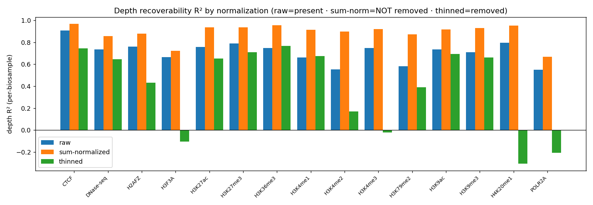
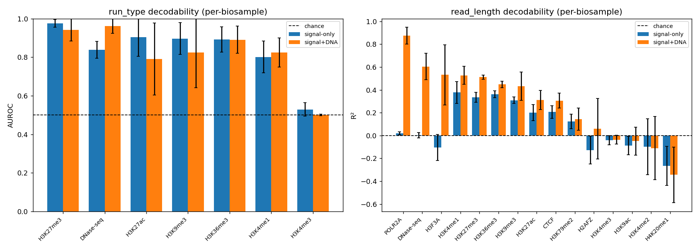
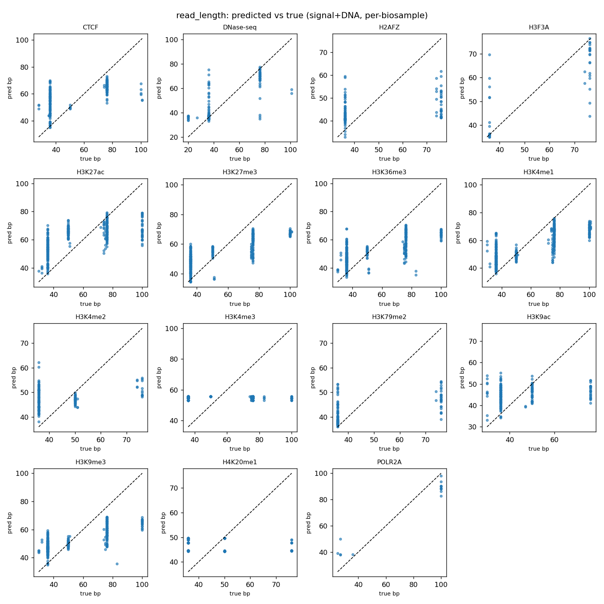

# Covariate decodability probes — results

## What was done

Per ENCODE assay, we ask whether a track's **run_type** (single/paired) and **read_length** are recoverable from the *shape* of its read-count signal (768×25 bp = 19.2 kb windows) and DNA sequence, **after controlling for sequencing depth**. A small CANDI-style encoder (Conv1D count tower + optional DNA tower → 2-layer transformer → linear head) is trained per assay/target. No metadata (`x_meta`) is given to the model.

## Data

MERGED dataset (`DATA_CANDI_MERGED`), full-depth counts `signal_DSF1_res25` at 25 bp; DNA from hg38. Labels read per-instance from `file_metadata.json`. **Double holdout**: train = chr19 windows of train cell types, test = chr21 windows of *unseen* cell types (grouping = base cell type, so technical replicates never straddle the split). 5 stratified group splits; metrics reported **per-biosample** (window predictions averaged per held-out instance), mean±std over splits.

## Depth control & a key finding

Depth is recoverable from raw counts. **Neither sum-count normalization NOR binomial thinning to a common depth removes it**: depth stays predictable on *held-out cell types* under both (median thinned depth R² ≈ 0.64). The most likely cause is a **depth↔biology confound** in the cohort — deeper-sequenced samples are systematically different cell types, so the model reads a biological axis that co-varies with depth, which no count-normalization can strip. Probes use thinned input (the best available control). Per-assay depth R²:

| assay | raw | sum-normalized | thinned |
|---|---|---|---|
| CTCF | 0.906±0.021 | 0.967±0.008 | 0.744±0.058 |
| DNase-seq | 0.735±0.034 | 0.857±0.018 | 0.644±0.134 |
| H2AFZ | 0.761±0.045 | 0.878±0.041 | 0.431±0.175 |
| H3F3A | 0.665±0.123 | 0.723±0.109 | -0.105±0.063 |
| H3K27ac | 0.757±0.122 | 0.935±0.030 | 0.651±0.046 |
| H3K27me3 | 0.790±0.040 | 0.937±0.028 | 0.709±0.075 |
| H3K36me3 | 0.748±0.035 | 0.957±0.009 | 0.766±0.050 |
| H3K4me1 | 0.663±0.112 | 0.915±0.040 | 0.674±0.035 |
| H3K4me2 | 0.554±0.126 | 0.897±0.028 | 0.171±0.291 |
| H3K4me3 | 0.749±0.030 | 0.922±0.042 | -0.022±0.035 |
| H3K79me2 | 0.581±0.046 | 0.873±0.027 | 0.389±0.119 |
| H3K9ac | 0.735±0.051 | 0.917±0.037 | 0.693±0.049 |
| H3K9me3 | 0.710±0.042 | 0.930±0.020 | 0.661±0.042 |
| H4K20me1 | 0.796±0.039 | 0.951±0.015 | -0.306±0.351 |
| POLR2A | 0.549±0.396 | 0.668±0.283 | -0.207±0.163 |

> **Caveat for the headline below:** because depth is not fully removable and run_type/read_length correlate with depth, part of their decodability may reflect the depth↔biology axis rather than a pure covariate fingerprint. The label-shuffle control (≈0.5) rules out trivial biology *relabeling*, but not this confound. Recommended follow-up: depth-*matched* contrasts (subsample so the two run_type classes share a depth distribution).

## Controls (from validation)

- **label-shuffle** → AUROC ~0.5 (no spurious signal) · **DNA-only** → AUROC ~0.5 (DNA alone can't see a per-biosample label) · **overfit-tiny** → ~1.0 (model can learn). See the validation log for exact numbers.

## Headline: covariate decodability (per-biosample, depth-controlled)

| assay | run_type AUROC (signal) | run_type AUROC (+DNA) | read_length R² (signal) | read_length R² (+DNA) |
|---|---|---|---|---|
| CTCF | – | – | 0.206±0.054 | 0.306±0.065 |
| DNase-seq | 0.838±0.044 | 0.962±0.038 | 0.004±0.023 | 0.605±0.115 |
| H2AFZ | – | – | -0.127±0.122 | 0.060±0.264 |
| H3F3A | – | – | -0.105±0.113 | 0.532±0.262 |
| H3K27ac | 0.903±0.098 | 0.791±0.187 | 0.202±0.071 | 0.311±0.083 |
| H3K27me3 | 0.975±0.019 | 0.941±0.057 | 0.334±0.043 | 0.511±0.020 |
| H3K36me3 | 0.892±0.066 | 0.890±0.071 | 0.361±0.029 | 0.448±0.029 |
| H3K4me1 | 0.801±0.082 | 0.824±0.076 | 0.377±0.095 | 0.527±0.079 |
| H3K4me2 | – | – | -0.097±0.244 | -0.110±0.276 |
| H3K4me3 | 0.529±0.035 | 0.500±0.004 | -0.041±0.041 | -0.036±0.039 |
| H3K79me2 | – | – | 0.124±0.063 | 0.145±0.098 |
| H3K9ac | – | – | -0.089±0.080 | -0.049±0.122 |
| H3K9me3 | 0.896±0.083 | 0.823±0.181 | 0.309±0.028 | 0.432±0.125 |
| H4K20me1 | – | – | -0.265±0.171 | -0.344±0.244 |
| POLR2A | – | – | 0.019±0.013 | 0.874±0.073 |

## Interpretation

AUROC>0.5 / R²>0 on *unseen cell types & chromosome at common depth* ⇒ a genuine, generalizable covariate fingerprint exists in the signal shape. A positive **DNA lift** (+DNA > signal-only) implicates mappability as the mechanism. This is the precondition for CANDI's metadata conditioning / supertrack goal.

