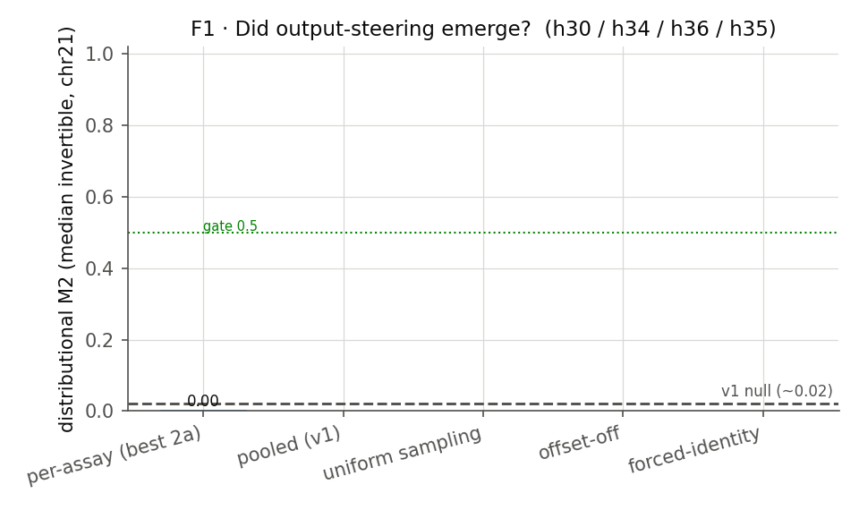
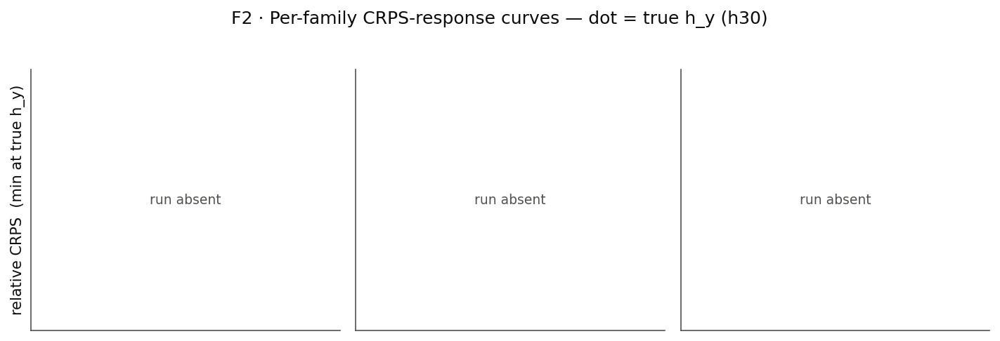
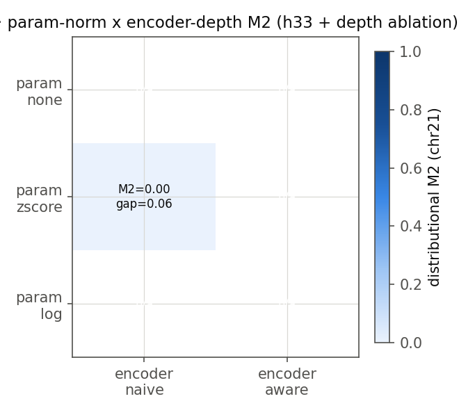
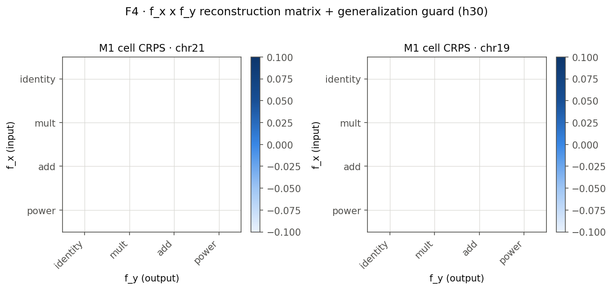
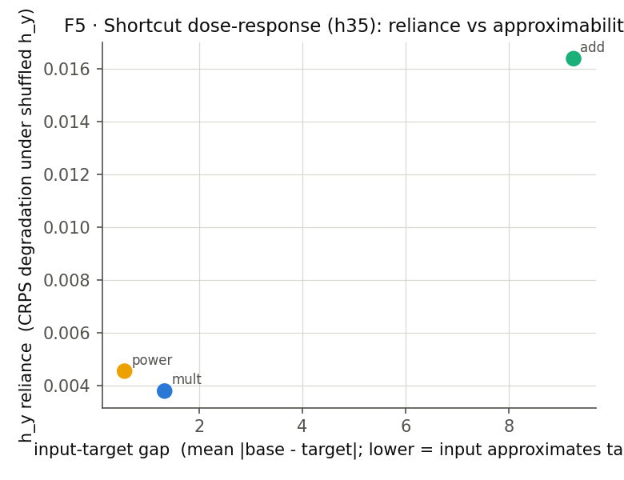
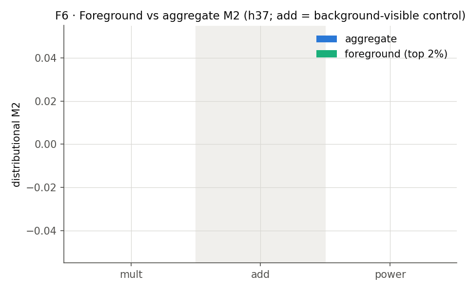
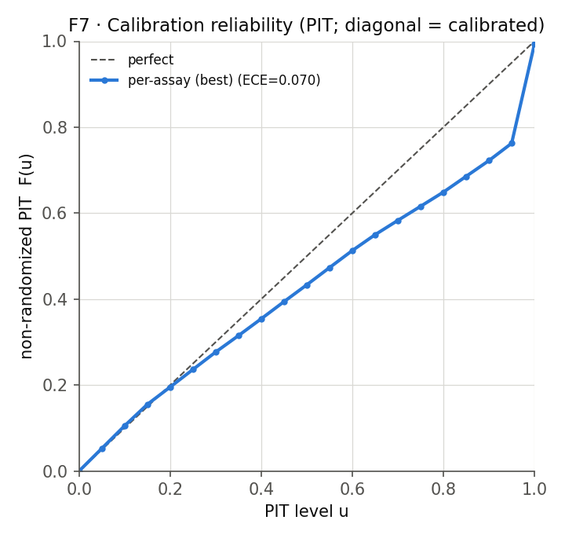
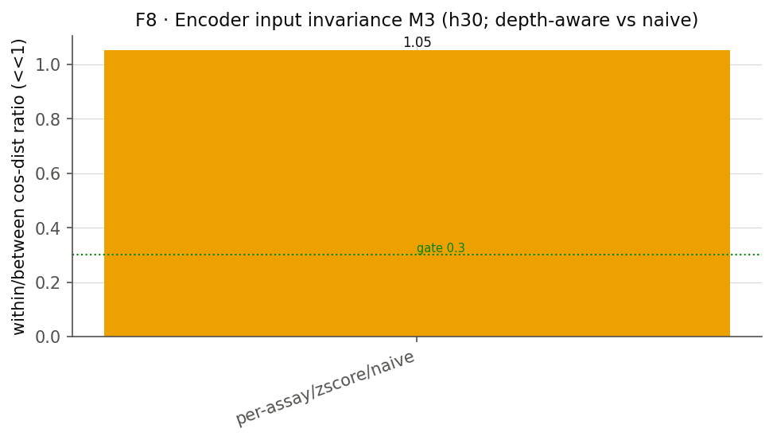

# Dual metadata-conditioning — Phase 2 synthesis (crux q15 / q16)

_Auto-generated by report.py. Story spine: did steering emerge (h30), was v1's null a pooling artifact (h34), unconditional or preconditioning-dependent (h36), input-shortcut (h35), foreground/background (h37), best param-encoding (h33)._

> **DRY-RUN (gate J smoke)** — figures/tables generated from a tiny run; numbers are not meaningful, only the pipeline is exercised.

## Top-level scorecard

## h30 — Dual conditioning is learnable (full matrix seen)

**Verdict: rejected**  ·  best cell: `smoke`

| verifiable | target | value | status |
|---|---|---|---|
| M1 ceiling-gap | <= 0.05 CRPS | 0.063 | unmet |
| M2 distributional (median inv) | >= 0.6 | 0.002 | unmet |
| M3 within/between ratio | <= 0.3 | 1.053 | unmet |
| generalization gap |chr19-chr21| | <= 0.10 | 0.885 | unmet |

_Evidence: F1 (headline), F2 (per-family), F4 (matrix + generalization), F8 (M3)._

## h34 — Per-assay conditioning is necessary (v1 null = across-assay pooling artifact)

**Verdict: rejected**  ·  pooling artifact isolated by contrasting the per-assay decoder vs the v1 pooled decoder; the uniform-sampling arm separates the sampling effect.

| verifiable | target | value | status |
|---|---|---|---|
| per-assay M2 (per-assay eval) | >= 0.5 | 0.002 | unmet |
| POOLED(v1) M2 (pooling artifact = v1 null) | <= 0.15 | n/a | n-a |
| lift (per-assay - pooled) | >= 0.35 | n/a | n-a |
| uniform-sampling control M2 (informational) | sampling effect | n/a | n-a |

_Evidence: F1._

## h36 — Offset attribution (unconditional vs preconditioning)

**Verdict: rejected**  ·  attribution: **n/a**

| verifiable | target | value | status |
|---|---|---|---|
| offset-on M2 | >= 0.5 | 0.002 | unmet |
| attribution | unconditional / preconditioning | n/a | n-a |
| readout guard (Delta log_mu offset-invariant) | gate E cancellation | verified | met |

_Evidence: F1._

## h35 — Steering achievable in the isolated regime + shortcut

**Verdict: inconclusive (runs absent)**

| verifiable | target | value | status |
|---|---|---|---|
| forced-identity positive-control M2 | >= 0.5 | n/a | n-a |
| shortcut dose-response (reliance vs approximability) | negative trend | see F5 | n-a |

_Evidence: F1 (floor), F5 (shortcut)._

## h37 — Background domination (steering is foreground-localised)

**Verdict: inconclusive (runs absent)**

| verifiable | target | value | status |
|---|---|---|---|
| foreground-vs-aggregate M2 gap (fg families) | >= 0.2 | n/a | n-a |
| specificity (fg-families gap > add gap) | add minimal | n/a | n-a |

_Evidence: F6._

## h33 — Param-encoding normalization is load-bearing

**Verdict: inconclusive (runs absent)**

| verifiable | target | value | status |
|---|---|---|---|
| z-score vs none M2 lift | >= 0.10 | n/a | n-a |
| full ordering | rank 3 arms | zscore=0.00, none=n/a, log=n/a | n-a |

_Evidence: F3._

## Tables

### T1 · Reconstruction (chr19 train / chr21 test)

| run | CRPS19 | CRPS21 | NLL19 | NLL21 | Spear19 | Spear21 | Pear19 | Pear21 | ECE19 | ECE21 | R2_19 | R2_21 |
|---|---|---|---|---|---|---|---|---|---|---|---|---|
| per-assay/zscore/naive | 6.455 | 3.988 | 4.404 | 3.492 | 0.343 | 0.257 | 0.333 | 0.167 | 0.141 | 0.070 | -0.003 | -0.191 |

### T2 · Steering + invariance (chr21)

| run | M2 (median inv) | mean-stat (mult) | tail-stat (mult) | M3 ratio |
|---|---|---|---|---|
| per-assay/zscore/naive | 0.002 | n/a | n/a | 1.053 |

### T3 · M3 per-family invariance ratio

| family | within/between ratio (chr21) |
|---|---|
| mult | 1.134 |
| add | 1.358 |
| power | 0.666 |

## Figures

