# Dual metadata-conditioning — Phase 2 synthesis (crux q15 / q16)

_Auto-generated by report.py. Story spine: did steering emerge (h30), was v1's null a pooling artifact (h34), unconditional or preconditioning-dependent (h36), input-shortcut (h35), foreground/background (h37), best param-encoding (h33)._

> **DRY-RUN (gate J smoke)** — figures/tables generated from a tiny run; numbers are not meaningful, only the pipeline is exercised.

## Top-level scorecard

## h30 — Dual conditioning is learnable (full matrix seen)

**Verdict: rejected**  ·  best cell: `c2c`

| verifiable | target | value | status |
|---|---|---|---|
| M1 ceiling-gap | <= 0.05 CRPS | 0.137 | unmet |
| M2 distributional (median inv) | >= 0.6 | 0.000 | unmet |
| M3 within/between ratio | <= 0.3 | 1.086 | unmet |
| generalization gap |chr19-chr21| | <= 0.10 | 0.137 | unmet |

_Evidence: F1 (headline), F2 (per-family), F4 (matrix + generalization), F8 (M3)._

## h34 — Per-assay conditioning is necessary (v1 null = across-assay pooling artifact)

**Verdict: rejected**  ·  pooling artifact isolated by contrasting the per-assay decoder vs the v1 pooled decoder; the uniform-sampling arm separates the sampling effect.

| verifiable | target | value | status |
|---|---|---|---|
| per-assay M2 (per-assay eval) | >= 0.5 | 0.000 | unmet |
| POOLED(v1) M2 (pooling artifact = v1 null) | <= 0.15 | n/a | n-a |
| lift (per-assay - pooled) | >= 0.35 | n/a | n-a |
| uniform-sampling control M2 (informational) | sampling effect | n/a | n-a |

_Evidence: F1._

## h36 — Offset attribution (unconditional vs preconditioning)

**Verdict: rejected**  ·  attribution: **n/a**

| verifiable | target | value | status |
|---|---|---|---|
| offset-on M2 | >= 0.5 | 0.000 | unmet |
| attribution | unconditional / preconditioning | n/a | n-a |
| readout guard (Delta log_mu offset-invariant) | gate E cancellation | verified | met |

_Evidence: F1._

## h35 — Steering achievable in the isolated regime + shortcut

**Verdict: inconclusive (runs absent)**

| verifiable | target | value | status |
|---|---|---|---|
| forced-identity positive-control M2 | >= 0.5 | n/a | n-a |
| shortcut dose-response (reliance vs approximability) | negative trend | see F5 | n-a |

_Evidence: F1 (floor), F5 (shortcut)._

## h37 — Background domination (steering is foreground-localised)

**Verdict: rejected**

| verifiable | target | value | status |
|---|---|---|---|
| foreground-vs-aggregate M2 gap (fg families) | >= 0.2 | -0.001 | unmet |
| specificity (fg-families gap > add gap) | add minimal | -0.000 | unmet |

_Evidence: F6._

## h33 — Param-encoding normalization is load-bearing

**Verdict: inconclusive (runs absent)**

| verifiable | target | value | status |
|---|---|---|---|
| z-score vs none M2 lift | >= 0.10 | n/a | n-a |
| full ordering | rank 3 arms | none=0.00, zscore=n/a, log=n/a | n-a |

_Evidence: F3._

## Phase 2c (h32) + h31 composition

## h32 — Invertibility sets difficulty (invert-input harder than apply-output)

**Verdict: partial**  ·  2c run: `c2c`

| verifiable | target | value | status |
|---|---|---|---|
| difficulty ranking (non-inv M1 gap > inv) | non-inv harder | 0.887→1.250 | met |
| input-side M3 cost (non-inv > inv) | non-inv higher ratio | 0.872→1.301 | met |
| invert-harder-than-apply (M2 identity-fx > lossy-fx) | steering drops under load | 0.001→0.001 | unmet |
| steering locus (reshaping tail-stat >= 0.5) | tail carries it | see T4/F10 | unmet |

_Evidence: F4 (7×7 M1), F9 (M2 matrix), F10 (locus), T4._

## h31 — Compositional generalization to unseen (f_x, f_y) pairings

**Verdict: partial**  ·  rho sweep: `[0.3]`

| verifiable | target | value | status |
|---|---|---|---|
| per-cell generalization (held within 0.10 at rho~0.3) | >= 50% of held cells | 0.78 | met |
| beats memorization (frac correct-f_y closer) | >= 0.5 | 0.44 | unmet |
| dose-response monotone (gen-gap grows with rho) | non-decreasing | 1 | met |

_Evidence: F11 (gen-gap matrix), F12 (dose-response), F13 (compose grid), F14 (memorization), T5._

## Tables

### T1 · Reconstruction (chr19 train / chr21 test)

| run | CRPS19 | CRPS21 | NLL19 | NLL21 | Spear19 | Spear21 | Pear19 | Pear21 | ECE19 | ECE21 | R2_19 | R2_21 |
|---|---|---|---|---|---|---|---|---|---|---|---|---|
| per-assay/none/naive | 4.635 | 2.627 | 3.556 | 2.522 | 0.374 | 0.216 | 0.333 | 0.171 | 0.101 | 0.046 | -0.003 | -0.038 |
| per-assay/none/naive | 4.662 | 2.638 | 3.578 | 2.547 | 0.372 | 0.212 | 0.336 | 0.168 | 0.108 | 0.054 | -0.003 | -0.036 |

### T2 · Steering + invariance (chr21)

| run | M2 (median inv) | mean-stat (mult) | tail-stat (mult) | M3 ratio |
|---|---|---|---|---|
| per-assay/none/naive | 0.000 | 0.682 | 0.555 | 1.086 |
| per-assay/none/naive | 0.000 | 0.702 | 0.664 | 1.316 |

### T3 · M3 per-family invariance ratio

| family | within/between ratio (chr21) |
|---|---|
| mult | 1.538 |
| add | 0.748 |
| power | 0.330 |
| thin | 1.368 |
| cap | 0.534 |
| clog | 2.002 |

### T4 · h32 per-family difficulty + steering locus (2c, chr21)

| family | class | M1 gap (f_x row) | M3 ratio (input) | M2 mean-stat r | M2 tail-stat r |
|---|---|---|---|---|---|
| mult | inv | 0.769 | 1.538 | 0.682 | 0.555 |
| add | inv | 0.236 | 0.748 | 0.241 | -0.242 |
| power | inv | 1.655 | 0.330 | 0.420 | 0.543 |
| thin | NON-inv | 0.751 | 1.368 | 0.076 | 0.257 |
| cap | NON-inv | 2.010 | 0.534 | 0.177 | -0.289 |
| clog | NON-inv | 0.989 | 2.002 | 0.420 | -0.118 |

### T5 · h31 sparsity dose-response + memorization (chr21)

| rho | held cells | median M1 gen-gap | frac within 0.10 | median M2 gen-gap | memoriz. frac-beats |
|---|---|---|---|---|---|
| 0.3 | 9 | 0.019 | 0.78 | 0.000 | 0.44 |

## Figures

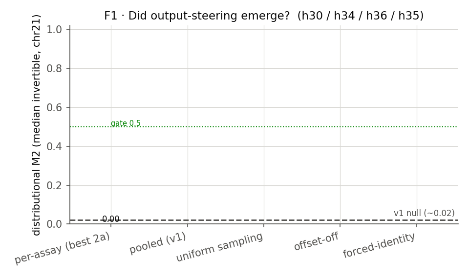

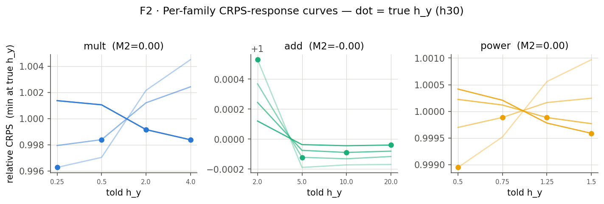

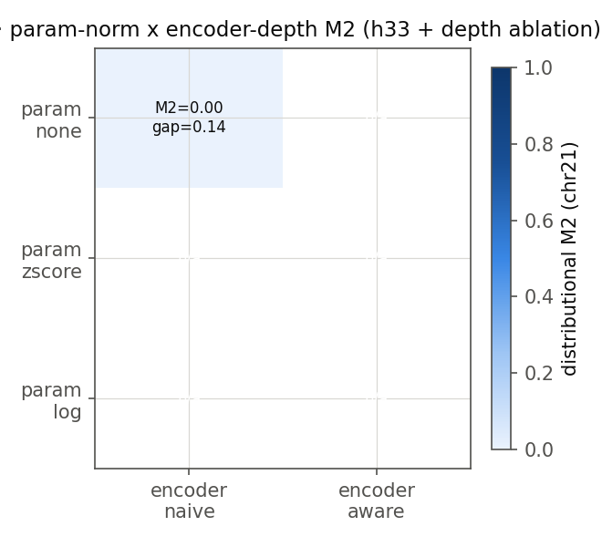

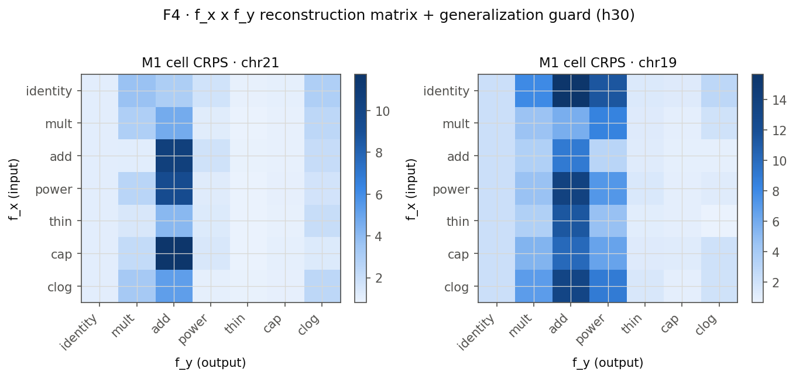

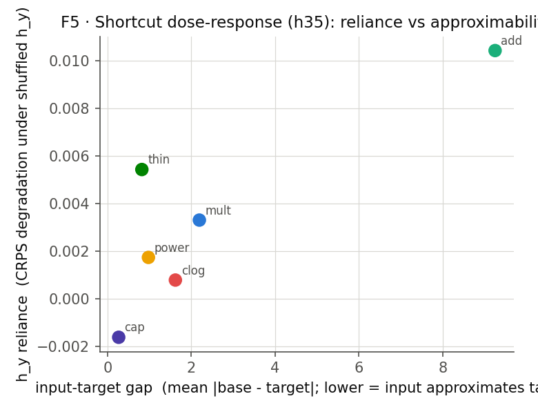

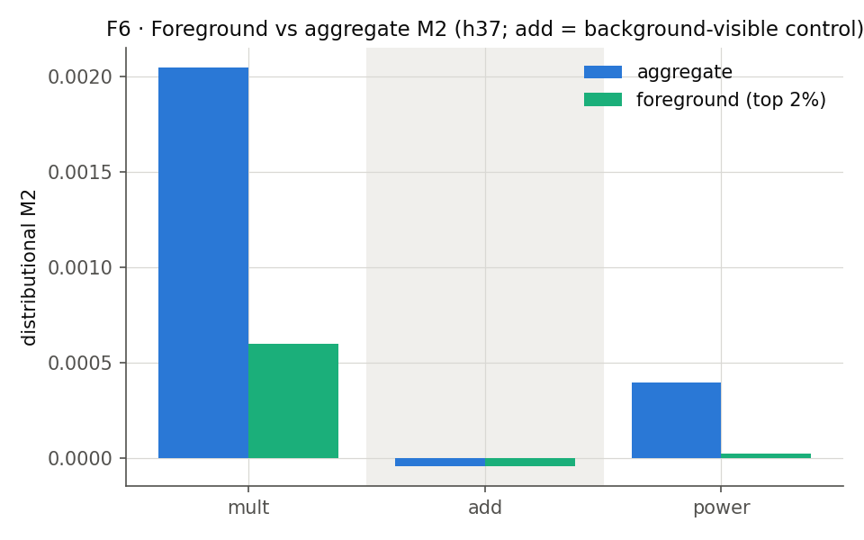

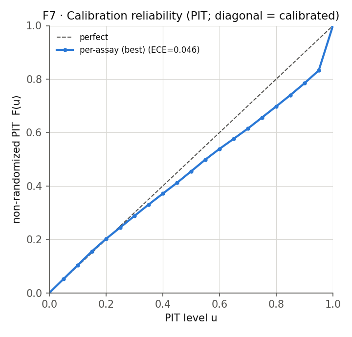

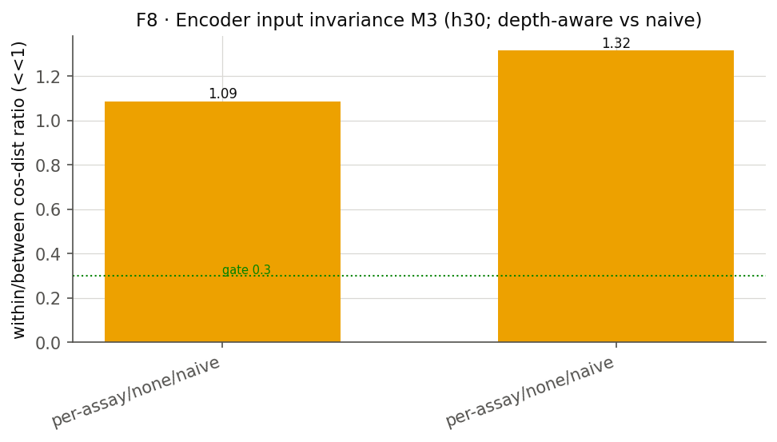

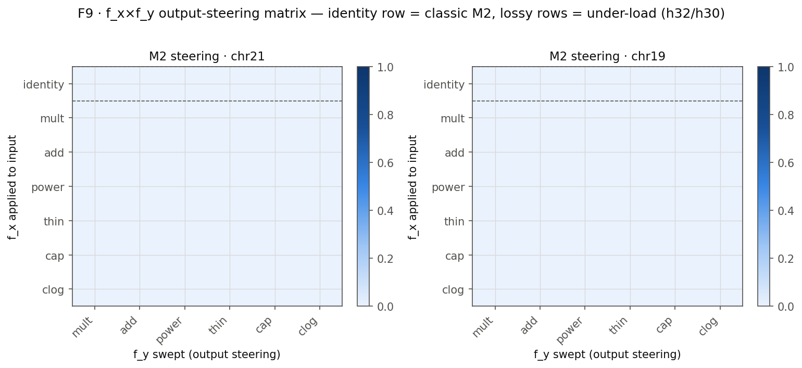

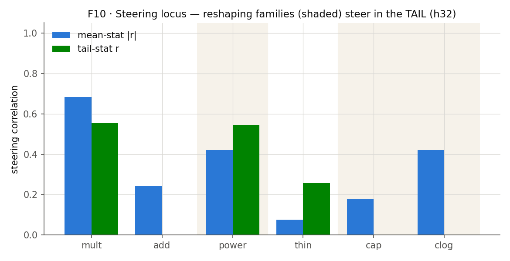

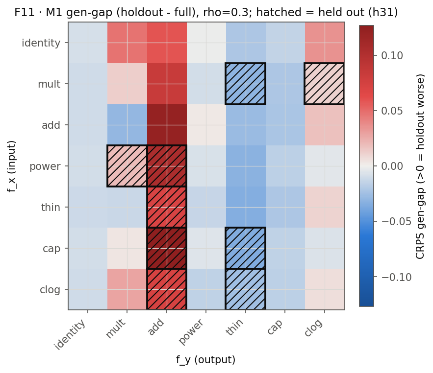

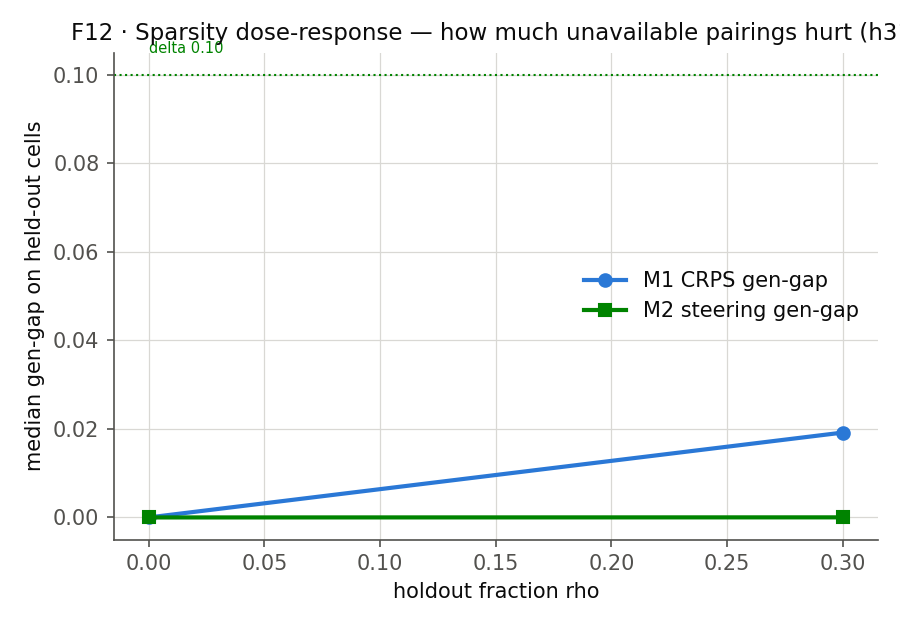

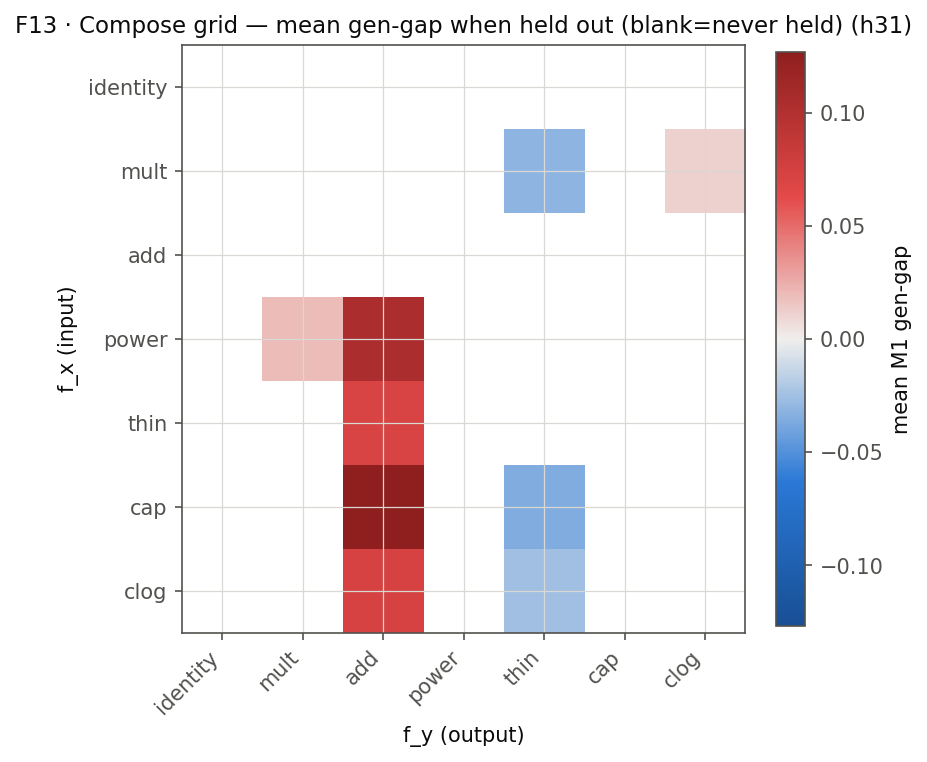

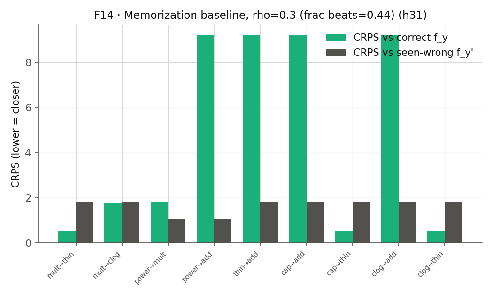
