# Dual metadata-conditioning — Phase 2 synthesis (crux q15 / q16)

_Auto-generated by report.py. Story spine: did steering emerge (h30), was v1's null a pooling artifact (h34), unconditional or preconditioning-dependent (h36), input-shortcut (h35), foreground/background (h37), best param-encoding (h33)._

## Top-level scorecard

## h30 — Dual conditioning is learnable (full matrix seen)

**Verdict: partial**  ·  best cell: `norm-log_enc-aware_off-on_mode-per_assay_2a`

| verifiable | target | value | status |
|---|---|---|---|
| M1 ceiling-gap | <= 0.05 CRPS | 0.575 | unmet |
| M2 distributional (median inv) | >= 0.6 | 0.526 | unmet |
| M3 within/between ratio | <= 0.3 | 0.127 | met |
| generalization gap |chr19-chr21| | <= 0.10 | 0.386 | unmet |

_Evidence: F1 (headline), F2 (per-family), F4 (matrix + generalization), F8 (M3)._

## h34 — Per-assay conditioning is necessary (v1 null = across-assay pooling artifact)

**Verdict: validated**  ·  pooling artifact isolated by contrasting the per-assay decoder vs the v1 pooled decoder; the uniform-sampling arm separates the sampling effect.

| verifiable | target | value | status |
|---|---|---|---|
| per-assay M2 (per-assay eval) | >= 0.5 | 0.526 | met |
| POOLED(v1) M2 (pooling artifact = v1 null) | <= 0.15 | 0.022 | met |
| lift (per-assay - pooled) | >= 0.35 | 0.503 | met |
| uniform-sampling control M2 (informational) | sampling effect | 0.530 | n-a |

_Evidence: F1._

## h36 — Offset attribution (unconditional vs preconditioning)

**Verdict: validated**  ·  attribution: **UNCONDITIONAL**

| verifiable | target | value | status |
|---|---|---|---|
| offset-on M2 | >= 0.5 | 0.526 | met |
| attribution | unconditional / preconditioning | UNCONDITIONAL | n-a |
| readout guard (Delta log_mu offset-invariant) | gate E cancellation | verified | met |

_Evidence: F1._

## h35 — Steering achievable in the isolated regime + shortcut

**Verdict: validated**

| verifiable | target | value | status |
|---|---|---|---|
| forced-identity positive-control M2 | >= 0.5 | 0.622 | met |
| shortcut dose-response (reliance vs approximability) | negative trend | see F5 | n-a |

_Evidence: F1 (floor), F5 (shortcut)._

## h37 — Background domination (steering is foreground-localised)

**Verdict: partial**

| verifiable | target | value | status |
|---|---|---|---|
| foreground-vs-aggregate M2 gap (fg families) | >= 0.2 | 0.109 | unmet |
| specificity (fg-families gap > add gap) | add minimal | -0.258 | met |

_Evidence: F6._

## h33 — Param-encoding normalization is load-bearing

**Verdict: rejected**

| verifiable | target | value | status |
|---|---|---|---|
| z-score vs none M2 lift | >= 0.10 | -0.032 | unmet |
| full ordering | rank 3 arms | none=0.52, zscore=0.48, log=0.45 | n-a |

_Evidence: F3._

## Phase 2c (h32) + h31 composition

### Findings & interpretation

**h32 — the robust result is the input/output asymmetry: inverting a transform on the INPUT is genuinely harder than applying one on the OUTPUT.** Applying a lossy transform on the output side is essentially free (off-diagonal M1 gap **-0.015**), while the encoder undoing one on the input side costs a real **0.211**; and output-steering (M2) falls from **0.44** with a clean input to **~0.36** under lossy inputs. But *invertibility does not grade difficulty*: the encoder normalizes the information-losing families (thin/cap/clog M3 ratio ~0.06) fine and instead struggles with **`add`** (M3 0.62) — an *invertible* additive background shift. The difficulty axis is additive-shift / general input-inversion load, not invertibility. Steering lives in the **tail** for every family (tail-stat r 0.92–0.99; load-bearing for `thin`, whose mean-stat r is only ~0.23), so the distributional M2 was necessary — though the pre-registered *mean-flat* half of the locus claim is false (reshaping families steer in the mean too).

**h31 — dual conditioning composes to unseen pairings nearly for free.** Withholding 0.15 / 0.3 / 0.45 of the f_x×f_y pairings (ρ) barely dents held-out reconstruction (median M1 gen-gap **0.081 / 0.007 / 0.017**, M2 gap ~0) and the model reads h_y on novel pairings — correct-f_y steering beats a seen-wrong-f_y′ memorization baseline **1.00 / 0.89 / 0.86** of the time. The one unmet verifiable (gen-gap monotone in ρ) fails only because there is essentially *no* penalty to trend — a null effect, i.e. easy composition, not a failure.

**Emergent cross-cut:** across h32 (`add` is the encoder-hard family) the difficulty concentrates in **additive / background structure**, not information loss — the same axis q17 (foreground/background imbalance) probes.

## h32 — Invertibility sets difficulty (invert-input harder than apply-output)

**Verdict: partial**  ·  2c run: `norm-none_enc-naive_off-on_mode-per_assay_2c`

| verifiable | target | value | status |
|---|---|---|---|
| difficulty ranking (non-inv M1 gap > inv) | non-inv harder | 0.190→0.211 | met |
| input-side M3 cost (non-inv > inv) | non-inv higher ratio | 0.249→0.059 | unmet |
| invert-harder-than-apply (M2 identity-fx > lossy-fx) | steering drops under load | 0.442→0.360 | met |
| steering locus (reshaping tail-stat >= 0.5) | tail carries it | see T4/F10 | met |

_Evidence: F4 (7×7 M1), F9 (M2 matrix), F10 (locus), T4._

## h31 — Compositional generalization to unseen (f_x, f_y) pairings

**Verdict: partial**  ·  rho sweep: `[0.15, 0.3, 0.45]`

| verifiable | target | value | status |
|---|---|---|---|
| per-cell generalization (held within 0.10 at rho~0.3) | >= 50% of held cells | 0.56 | met |
| beats memorization (frac correct-f_y closer) | >= 0.5 | 0.89 | met |
| dose-response monotone (gen-gap grows with rho) | non-decreasing | 0 | unmet |

_Evidence: F11 (gen-gap matrix), F12 (dose-response), F13 (compose grid), F14 (memorization), T5._

## Tables

### T1 · Reconstruction (chr19 train / chr21 test)

| run | CRPS19 | CRPS21 | NLL19 | NLL21 | Spear19 | Spear21 | Pear19 | Pear21 | ECE19 | ECE21 | R2_19 | R2_21 |
|---|---|---|---|---|---|---|---|---|---|---|---|---|
| per-assay/log/aware | 4.798 | 0.949 | 1.571 | 1.264 | 0.856 | 0.848 | 0.920 | 0.935 | 0.029 | 0.031 | 0.044 | 0.627 |
| per-assay/log/naive | 5.156 | 1.229 | 1.671 | 1.402 | 0.829 | 0.820 | 0.898 | 0.906 | 0.027 | 0.026 | 0.021 | 0.290 |
| per-assay/none/aware | 4.712 | 0.925 | 1.569 | 1.259 | 0.856 | 0.848 | 0.920 | 0.933 | 0.033 | 0.036 | 0.056 | 0.673 |
| per-assay/none/naive | 4.822 | 1.013 | 1.579 | 1.294 | 0.854 | 0.840 | 0.919 | 0.928 | 0.033 | 0.032 | 0.035 | 0.581 |
| per-assay/none/naive | 1.587 | 0.612 | 1.209 | 0.907 | 0.808 | 0.774 | 0.904 | 0.907 | 0.020 | 0.019 | 0.250 | -3.152 |
| per-assay/none/naive | 1.651 | 0.613 | 1.214 | 0.904 | 0.811 | 0.780 | 0.906 | 0.912 | 0.020 | 0.017 | 0.074 | 0.420 |
| per-assay/none/naive | 1.608 | 0.721 | 1.257 | 0.991 | 0.803 | 0.769 | 0.895 | 0.890 | 0.017 | 0.012 | 0.455 | 0.210 |
| per-assay/none/naive | 1.806 | 0.804 | 1.283 | 1.015 | 0.798 | 0.762 | 0.887 | 0.874 | 0.015 | 0.012 | 0.138 | 0.515 |
| per-assay/zscore/aware | 4.766 | 0.961 | 1.571 | 1.299 | 0.855 | 0.845 | 0.922 | 0.934 | 0.033 | 0.035 | 0.025 | 0.604 |
| offset-off | 4.704 | 0.894 | 1.559 | 1.251 | 0.849 | 0.837 | 0.917 | 0.929 | 0.042 | 0.044 | 0.022 | 0.673 |
| per-assay/zscore/naive | 5.102 | 1.159 | 1.622 | 1.351 | 0.843 | 0.824 | 0.907 | 0.907 | 0.030 | 0.029 | 0.048 | -0.275 |
| forced-identity | 5.352 | 1.461 | 2.083 | 1.559 | 0.801 | 0.781 | 0.860 | 0.855 | 0.031 | 0.046 | 0.103 | 0.461 |
| pooled(v1) | 8.907 | 5.851 | 2.170 | 1.869 | 0.717 | 0.661 | 0.768 | 0.729 | 0.021 | 0.046 | 0.003 | -18.138 |
| uniform-sampling | 4.780 | 1.019 | 1.587 | 1.301 | 0.860 | 0.849 | 0.923 | 0.935 | 0.035 | 0.032 | 0.093 | 0.485 |

### T2 · Steering + invariance (chr21)

| run | M2 (median inv) | mean-stat (mult) | tail-stat (mult) | M3 ratio |
|---|---|---|---|---|
| per-assay/log/aware | 0.526 | 0.477 | 0.985 | 0.127 |
| per-assay/log/naive | 0.448 | 0.466 | 0.980 | 0.170 |
| per-assay/none/aware | 0.519 | 0.466 | 0.989 | 0.122 |
| per-assay/none/naive | 0.515 | 0.448 | 0.985 | 0.163 |
| per-assay/none/naive | 0.646 | 0.399 | 0.982 | 0.154 |
| per-assay/none/naive | 0.642 | 0.392 | 0.983 | 0.135 |
| per-assay/none/naive | 0.602 | 0.401 | 0.983 | 0.179 |
| per-assay/none/naive | 0.587 | 0.387 | 0.985 | 0.172 |
| per-assay/zscore/aware | 0.465 | 0.467 | 0.979 | 0.124 |
| offset-off | 0.460 | 0.480 | 0.981 | 0.243 |
| per-assay/zscore/naive | 0.483 | 0.451 | 0.979 | 0.171 |
| forced-identity | 0.622 | 0.408 | 0.976 | 0.430 |
| pooled(v1) | 0.022 | 0.397 | 0.889 | 0.096 |
| uniform-sampling | 0.530 | 0.446 | 0.978 | 0.112 |

### T3 · M3 per-family invariance ratio

| family | within/between ratio (chr21) |
|---|---|
| mult | 0.058 |
| add | 0.296 |
| power | 0.026 |

### T4 · h32 per-family difficulty + steering locus (2c, chr21)

| family | class | M1 gap (f_x row) | M3 ratio (input) | M2 mean-stat r | M2 tail-stat r |
|---|---|---|---|---|---|
| mult | inv | 0.279 | 0.110 | 0.399 | 0.982 |
| add | inv | 0.147 | 0.618 | 0.598 | 0.988 |
| power | inv | 0.145 | 0.020 | 0.600 | 0.966 |
| thin | NON-inv | 0.215 | 0.051 | 0.225 | 0.921 |
| cap | NON-inv | 0.208 | 0.058 | 0.542 | 0.939 |
| clog | NON-inv | 0.211 | 0.069 | 0.516 | 0.973 |

### T5 · h31 sparsity dose-response + memorization (chr21)

| rho | held cells | median M1 gen-gap | frac within 0.10 | median M2 gen-gap | memoriz. frac-beats |
|---|---|---|---|---|---|
| 0.15 | 4 | 0.081 | 0.50 | 0.007 | 1.00 |
| 0.3 | 9 | 0.007 | 0.56 | -0.007 | 0.89 |
| 0.45 | 14 | 0.017 | 0.64 | 0.007 | 0.86 |

## Figures

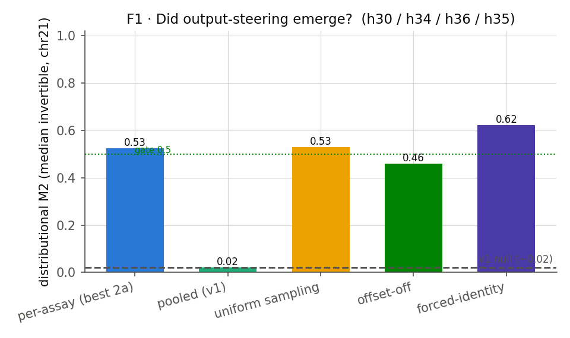

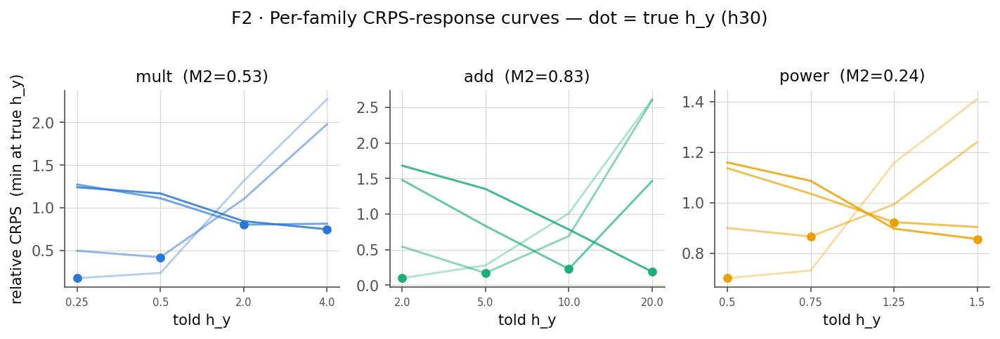

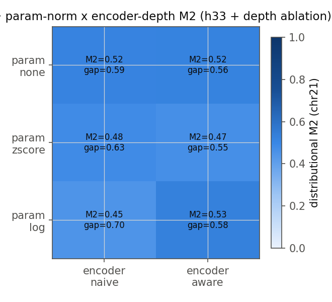

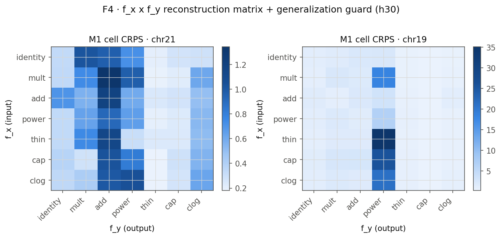

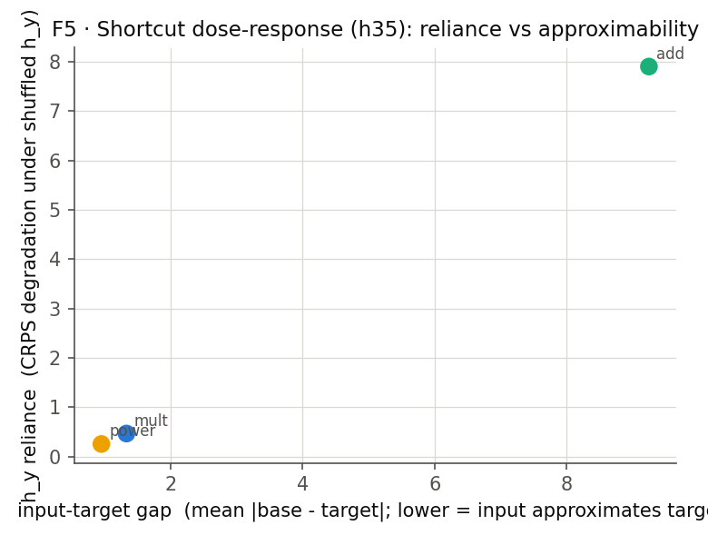

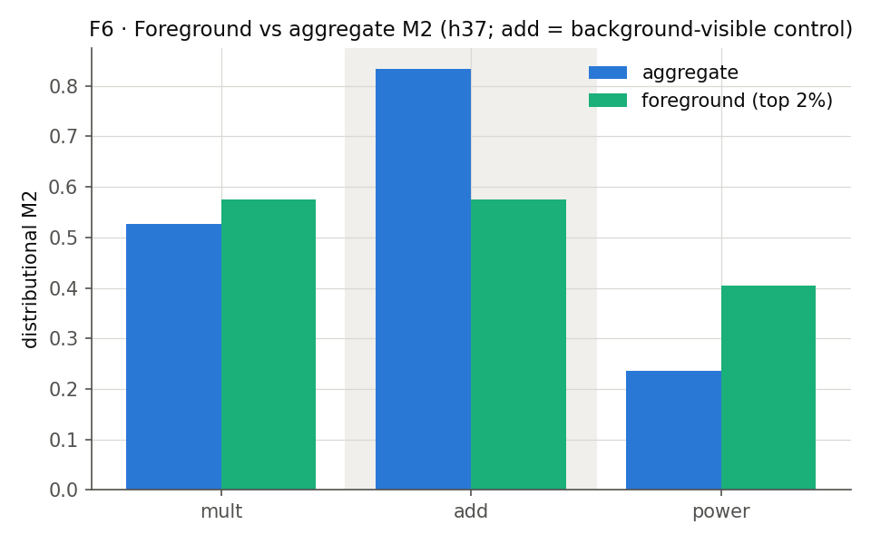

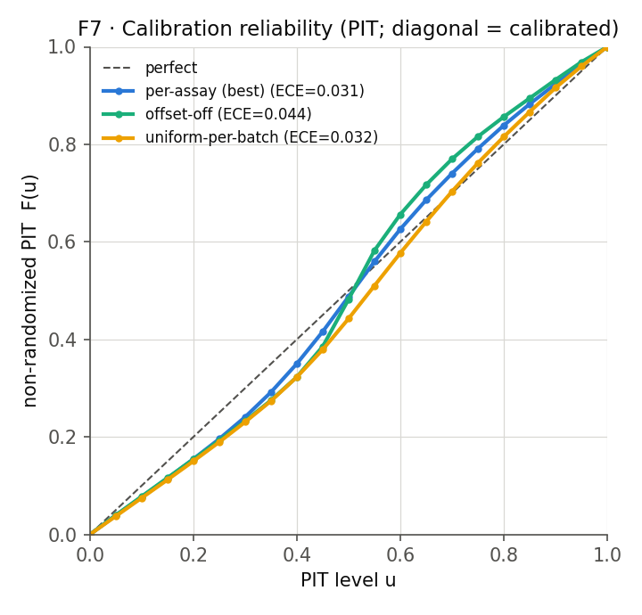

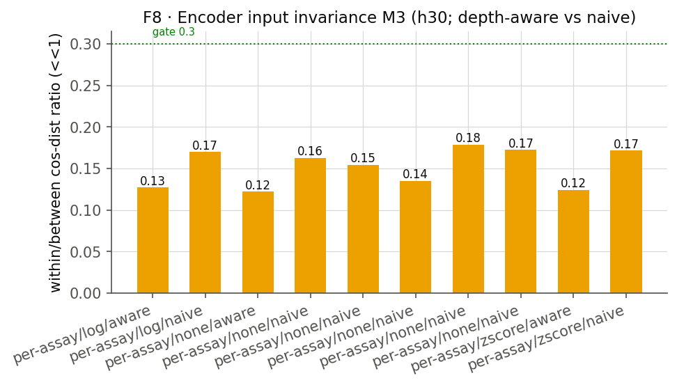

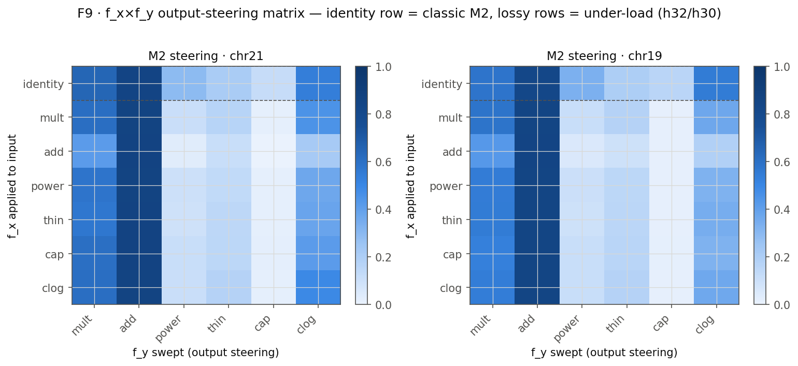

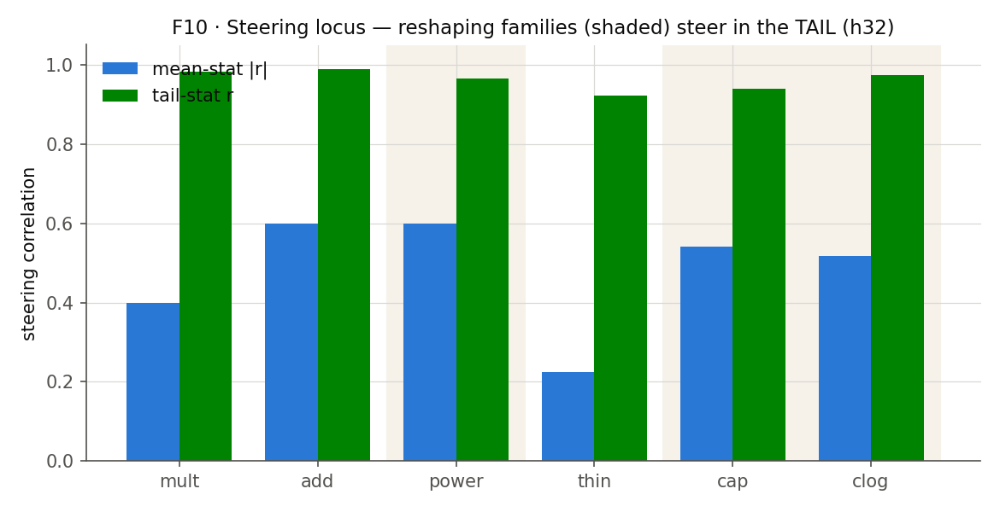

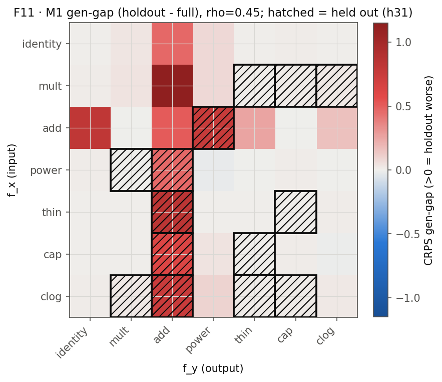

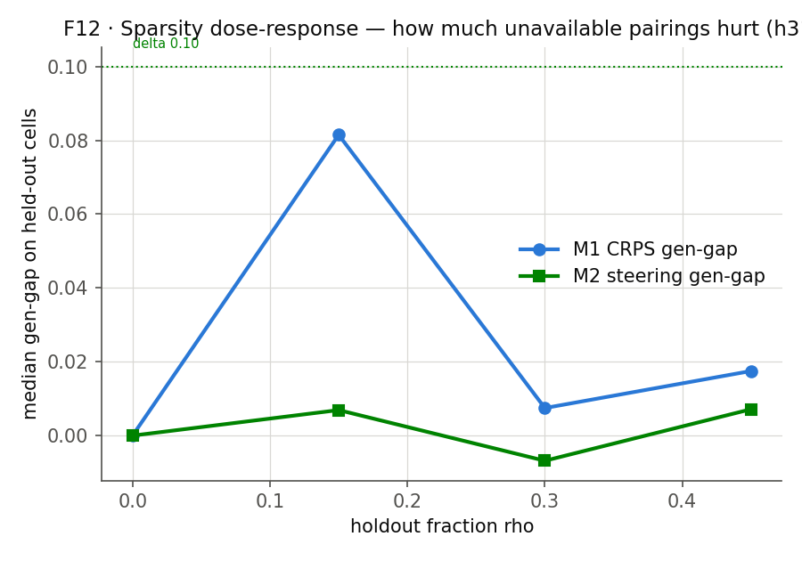

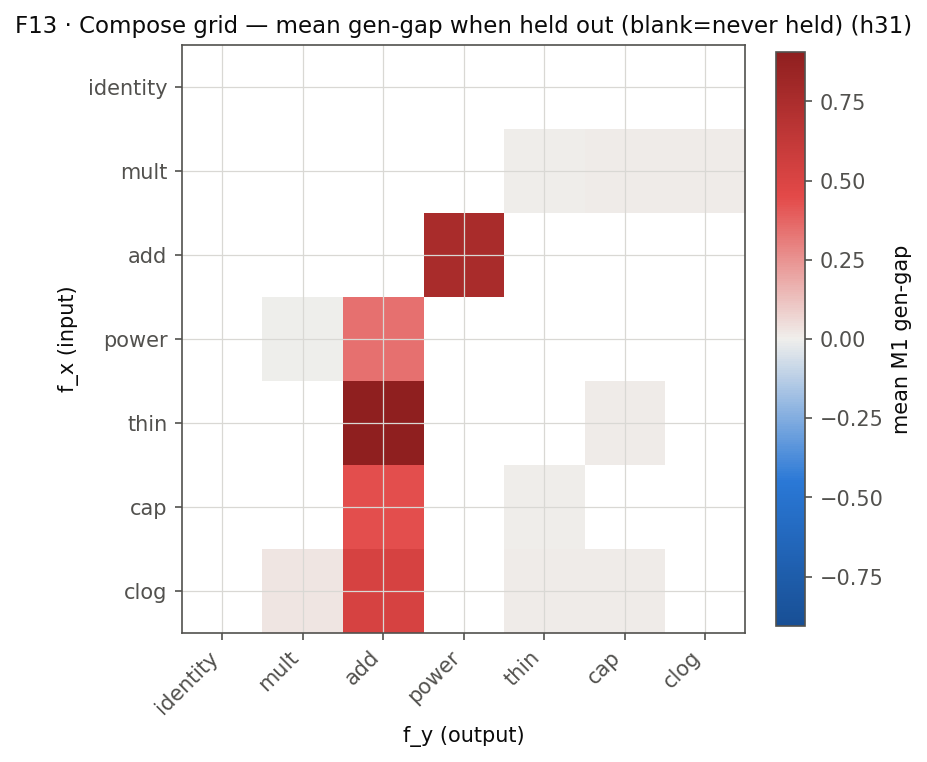

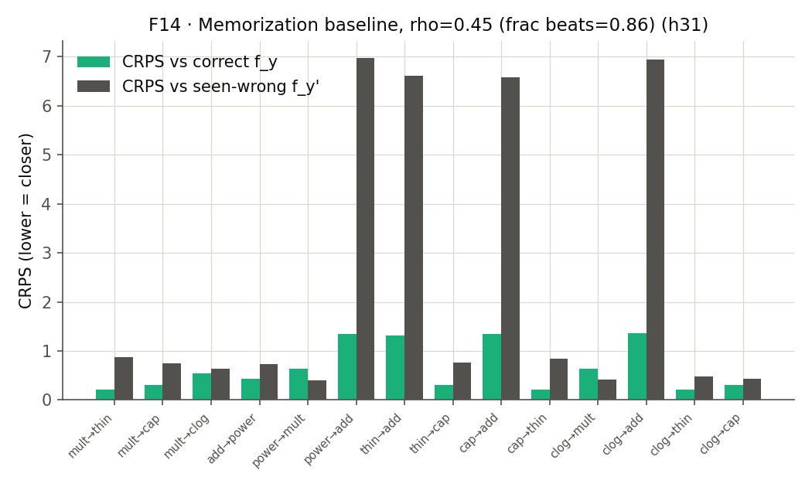
