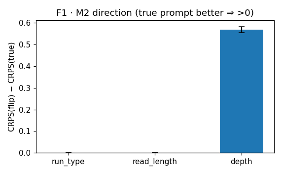
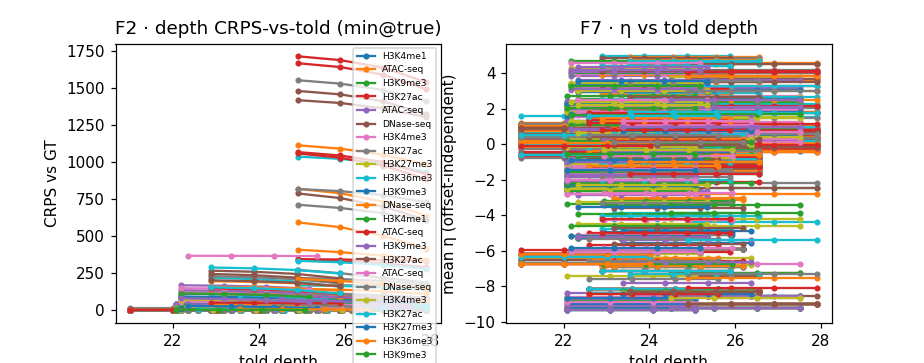
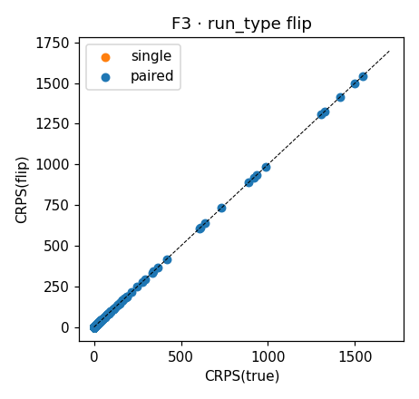
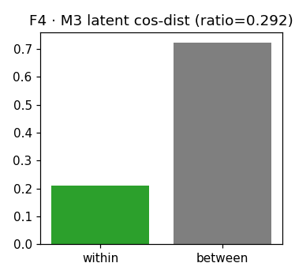
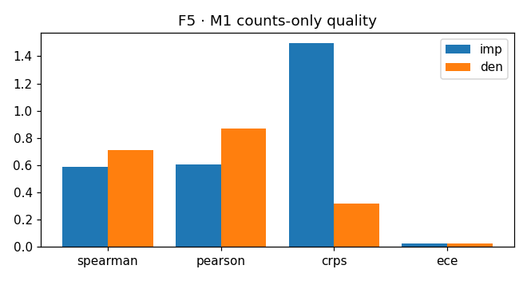
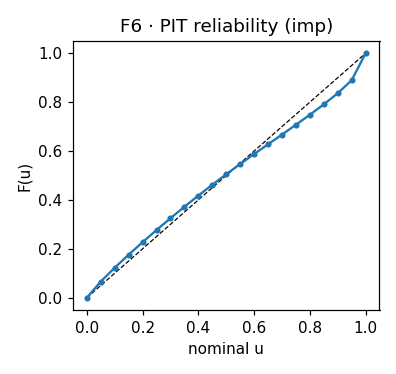

# q19 — dual conditioning on real CANDI sandbox data — report

**tag:** `main_s1_full` · offset=True · dsf=uniform · epochs=25 · n_units=608 · wall=5284.0s

## T1 · Scorecard (M1 health · M2 flip steering · M3 invariance)

| metric | value | verifiable |
|---|---|---|
| M1 imp Spearman | 0.589 | h40: healthy band |
| M1 imp Pearson | 0.608 | h40: > 0 |
| M1 den Spearman | 0.710 | h40: den ≥ imp |
| M1 health gate (den≥imp) | True | h40 |
| M1 imp CRPS | 1.497 | h40: ≤ marginal (2.206) |
| M1 imp PIT-ECE | 0.026 | h40: ≲ 0.10 |
| M1 encoder eff-rank | 51.96 | h40: > 1 |
| M2 depth frac min@true | 0.77 | h41: → 1 |
| M2 depth median η-slope | 0.000 | h41: offset-independent > 0 |
| M2 depth direction CI excl 0 | True | h41 |
| M2 depth null Δ (≈0) | 0.000 | h41: shuffle null |
| M2 run_type direction CI excl 0 | False | h42 |
| M2 run_type frac direction | 0.00 | h42 |
| M2 run_type responsiveness | 0.000 | h42 |
| M2 run_type natural-var-insufficient | True | h42: honest null |
| M2 read_length direction CI excl 0 | True | h42 (secondary) |
| M3 within/between ratio | 0.292 | h43: ≤ 0.3 |
| M3 encoder eff-rank | 24.46 | h43: > 1 (guard) |
| M3 invariance_ok | True | h43 |

## T2 · 12 held-out imputation targets (bios × assay × run_type)

| T_ biosample | imp | assay | idx | run_type |
|---|---|---|---|---|
| T_DND-41 | V_ | H3K4me1 | 3 | single |
| T_DND-41 | B_ | ATAC-seq | 0 | paired |
| T_DND-41 | B_ | H3K9me3 | 7 | paired |
| T_H1-hESC | V_ | H3K27ac | 4 | single |
| T_RWPE2 | B_ | ATAC-seq | 0 | paired |
| T_RWPE2 | B_ | DNase-seq | 1 | paired |
| T_RWPE2 | B_ | H3K4me3 | 2 | paired |
| T_RWPE2 | B_ | H3K27ac | 4 | paired |
| T_RWPE2 | B_ | H3K27me3 | 5 | paired |
| T_RWPE2 | B_ | H3K36me3 | 6 | paired |
| T_RWPE2 | B_ | H3K9me3 | 7 | paired |
| T_heart_left_ventricle | V_ | DNase-seq | 1 | single |

## Figures

**F1 · M2 direction bars (true vs flip per covariate)**

**F2 · depth CRPS-vs-told-depth (min@true) · F7 · η vs told-depth**

**F3 · run_type flip CRPS(true) vs CRPS(flip), single/paired**

**F4 · M3 within/between latent cos-dist**

**F5 · M1 counts-only quality**

**F6 · PIT reliability**

