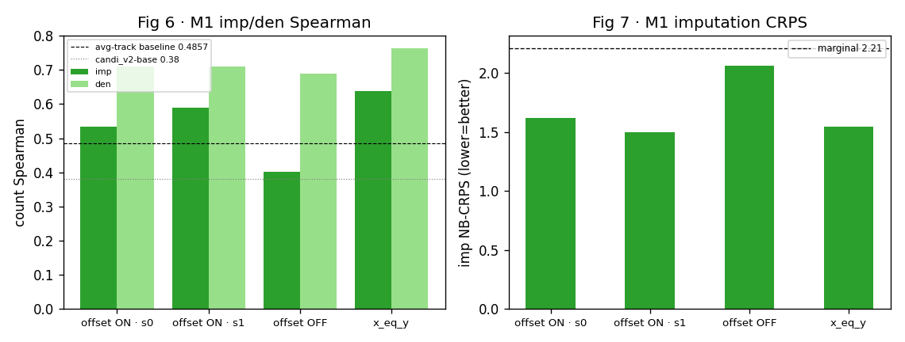
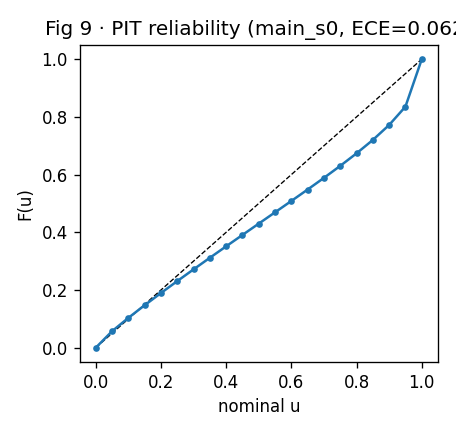
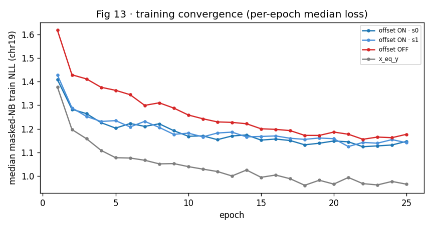
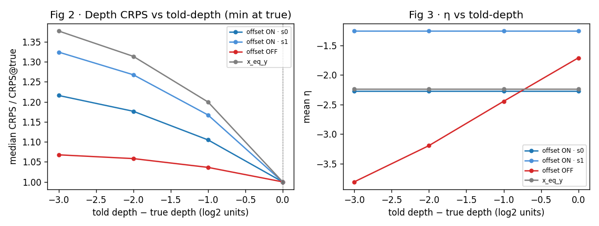
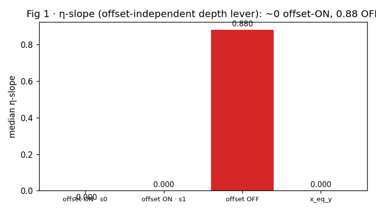
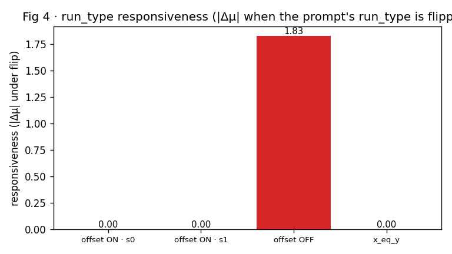
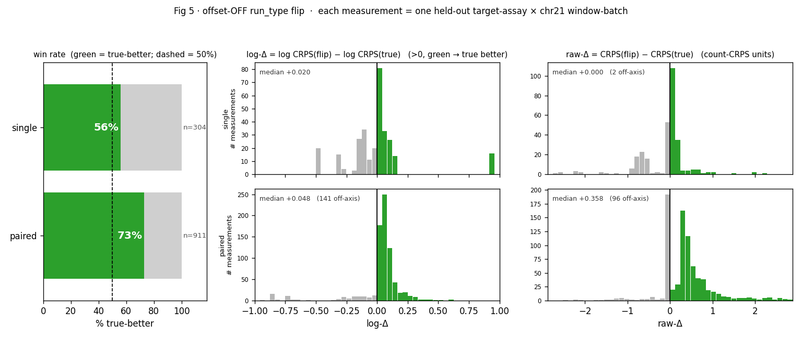
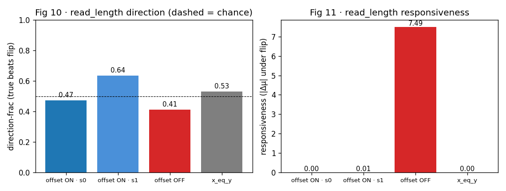
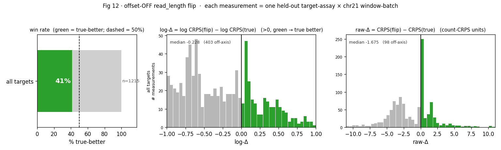
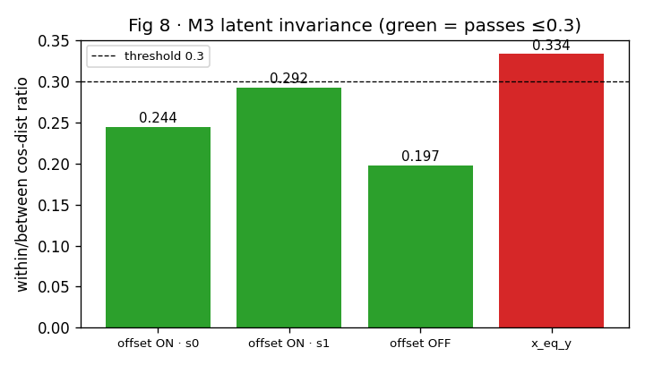

# q19 · Can we steer CANDI with real experimental metadata?
*Dual conditioning on real CANDI sandbox data — results and how to read them.*

## TL;DR

- **What we asked.** CANDI is told, per assay, the experimental covariates of the output it should produce (sequencing depth, assay, read length, single/paired). Does it actually *use* that prompt on real data — or just look like it?
- **It imputes well.** Held-out imputation on all of chr21 is healthy: imp-Spearman **0.53–0.59**, it clears the marginal-CRPS baseline, is calibrated, and denoising ≥ imputation. (h40 ✓)
- **The catch.** With the depth-offset head (the winning recipe), depth "steering" is **free arithmetic** (`μ ∝ 2^depth`), not *learned*: the honest lever `η` is flat (slope **≈0**), and run_type / read_length are **ignored** (the prompt barely moves the prediction). (h41 / h42 partial)
- **The reveal.** Turn the offset **off** and the model is forced to read the prompt: `η` learns depth (slope **0.88**), and run_type steering becomes real — the true prompt imputes **10 of 12** held-out targets better, strongly for paired (0.73 of paired instances). The offset was *starving* the learned pathway.
- **The biology is robust.** The encoder builds one depth-invariant biological latent whether the offset is on or off (M3 ratio 0.244/0.197 ≤ 0.3; a control breaks it). (h43 ✓)
- **Bottom line.** Dual conditioning is real and learnable, but there is an **offset on/off tradeoff**: offset-on buys better imputation + free depth calibration; offset-off buys genuinely learned steering at a real imputation cost (CRPS 2.06 vs 1.50–1.62, near the 2.21 floor). The follow-up (h45) is a hybrid that aims for both.

---

## 1 · The question, and the trap

**Question (q19).** Before scaling to production, does the dual-conditioning recipe reproduce *metadata steering* on **real** CANDI sandbox data — i.e. does telling the model a covariate actually change, and improve, what it outputs?

**The trap.** CANDI's count head is a depth-offset negative binomial: `log2(μ) = (depth − c) + η`. The `(depth − c)` term means the predicted mean scales with the told depth **by construction** — so if we only check "did the output move when I changed the depth prompt?", the answer is trivially yes, whether or not the model learned anything. A believable steering claim therefore has to separate two things: **(a) did the output move** (easy, and partly free), from **(b) did the model *learn to read* the prompt** (the real question). `η` — the part of the prediction the offset can't touch — is our honest lever for (b).

## 2 · How the experiment was run

**Data.** `sandbox.h5`: 8 ENCODE assays + a ChIP control, 5 biosamples stored as **T_/V_/B_** (Train / Validation / Blind-test) views that each hold a *different* subset of assays. We train on **T_ chr19** and evaluate on **chr21**. Because an assay present in a biosample's V_/B_ view but absent from its T_ input is never seen at input time, it gives a clean held-out **imputation target** whose only information channel is the prompt — there are **12** such targets (9 paired-end, 3 single-end; see T2). This run used the data *completely*: every epoch iterated all of chr19 for all 5 biosamples, and eval covered all of chr21 (608 eval batches, 3,732,480 scored positions, no subsampling).

**Model.** The golden-reference CANDI architecture — per-assay **FiLM** (feature-wise linear modulation; the mechanism that injects the metadata prompt) in the encoder and decoder, and a **counts-only** depth-offset NB head — with the real 4-row metadata `[log2 depth, assay_id, read_length, run_type]`. Depth feeds *both* the offset and the decoder FiLM, so `η` is able to carry a learned depth response if the model chooses to learn one.

**The four arms** (why each exists). *DSF = downsampling factor: in-silico reduction of sequencing depth, used to create depth counterfactuals.*

| arm | config | what it isolates |
|---|---|---|
| `main_s0` / `main_s1` | **offset ON**, per-assay independent DSF | the winning recipe (two seeds; s0/s1 differ only in the random seed — weight init, per-step DSF draws, cloze masking, and shuffle order) |
| `offoff_s0` | **offset OFF** | removes the `2^depth` shortcut → tests *learned* steering |
| `copyable_s0` | offset ON, `x_eq_y` DSF | `x`/`y` = **input-DSF vs target-DSF** (depths), *not* input/output assay: here the context and the target get the **same** downsample, so depth is *copyable* — the model never has to learn depth-normalization. A training regime (applies to den + imp alike); its role is the M3 control below |

**The readout — a counterfactual-prompt flip.** Real biology gives no ground-truth counterfactual (we can't observe the same position at a different depth), so for each held-out target we predict twice: once under the **true** prompt and once under a deliberately **wrong** one (flip run_type, or tell a wrong depth), and score *both* against the real held-out data with **CRPS** (a proper, full-distribution error — lower is better). Three questions follow: does the prediction *move* (**responsiveness** = mean absolute change in the predicted count mean μ when a covariate is flipped), does the *true* prompt score better (**direction**), and — for depth — does the offset-independent `η` track the told depth (**learned**, not arithmetic)? *Bootstrap CIs resample the pooled foreground positions (1000 resamples).*

## 3 · Does it impute at all? — the health check (Figs 6–7, 9)

**Experiment.** On the chr21 held-out targets, compare predicted vs real counts. **Metrics:** *count Spearman* (rank agreement of predicted vs true counts across positions, higher better), *NB-CRPS* (distributional error, lower better), and the sanity check that **denoising ≥ imputation** (reconstructing a seen assay shouldn't be harder than imputing an unseen one). Two *different* references anchor the plots, both for imputation: the **CRPS marginal** (**2.21**, Fig 7 dashed) is the score of a single position-independent NB fit to the pooled held-out counts (mean = their median, dispersion by method-of-moments) — the distribution you'd predict knowing nothing about position, so beating it means the model resolves *per-position* structure. The **Spearman references** in Fig 6 are external numbers from prior CANDI work — the position-wise average-track baseline (**0.4857**) and the candi_v2 production model (**0.38**) — not recomputed here (a constant marginal has no rank variance, so it has no Spearman of its own; these are the meaningful *per-position* baselines to clear).

**Read it.** The winning recipe imputes well: imp-Spearman **0.53 / 0.59** (seed0/1) — above the ~0.38 candi_v2 imputation band and clearing the 0.4857 average-track reference (both imputation baselines; compare to the *imp* bars, not den) — with den-Spearman **0.71 ≥ imp** (health holds), and imp-CRPS **1.62** beating the CRPS marginal **2.21**.

**Fig 9 — calibration.** The PIT reliability curve (non-randomized probability-integral transform of the held-out predictions: empirical F̄(u) vs nominal u; the diagonal = perfectly calibrated) tracks near the diagonal with a mild below-diagonal bow (ECE 0.062/0.026) — a small calibration deviation, not a red flag.

**Takeaway:** the model is genuinely competent, so the steering readouts below measure a real model, not noise.

### Did training converge? (Fig 13)

**All four arms converge.** Per-epoch median NLL (masked-NB, on the chr19 training targets) plateaus by ~epoch 15–20 — the last-5-epoch slope is ≈ 0 and the last-3-epoch coefficient of variation is < 1% — so the readouts measure *trained* models, not a mid-descent snapshot. **No underfitting:** the curves flatten well before the 25-epoch budget (the two main arms improve < 2% over the final 10 epochs; only the `copyable` control is still inching down, ~4%). The *levels* match the story: `copyable` sits lowest (~0.96 vs ~1.14) because input-depth = target-depth is an easier fit, and `offset-OFF` sits highest (~1.18, slowest descent from a higher start) because removing the `2^depth` shortcut makes the task harder. **Overfitting can't be read off the training curve alone** — this harness logs no validation-loss trajectory and keeps no per-epoch checkpoints — but the indirect evidence argues against a severe case: train loss *plateaus* rather than continuing to fall (a memorizing model would keep driving it down), chr21 (a different, held-out chromosome) imputation stays healthy (Spearman 0.53–0.64, CRPS < marginal), and the two seeds land on the same loss *and* the same metrics. A definitive verdict would need per-epoch chr21 eval + checkpointing — a cheap harness addition if we want it.

## 4 · Depth steering: learned, or just arithmetic? — the crux (Figs 2, 3, 1)

**Experiment.** For each target, *sweep the told depth* over the depths achievable by in-silico downsampling (DSF 1→8, i.e. true depth down to −3 log2 units), holding everything else fixed, and measure two things: the CRPS-vs-GT curve, and `η` (the offset-independent mean statistic) as a function of the told depth.

**Fig 2 — the output responds to the prompt.** The y-axis is CRPS at the told depth ÷ CRPS at the true depth (so **1.0 marks the true depth**); the curve rising away from x=0 means the prediction is worst when we lie about the depth — for all arms. So the prediction tracks the prompt. **But** this is precisely what the offset arithmetic gives for free, so on its own it proves nothing about learning. (The offset-ON arms degrade *more steeply* when mis-told, because `2^depth` makes μ hyper-sensitive to the told value.)

**Fig 3 & Fig 1 — is it *learned*?** `η` is the part of the prediction the `2^depth` offset cannot produce. If `η` rises with the told depth, the model *learned* to read depth; if `η` is flat, the depth response is pure arithmetic. The verdict is stark:

With the offset **ON**, `η` is flat (slope **≈0**) — the depth "steering" in Fig 2 is entirely the hardwired `2^depth` term. With the offset **OFF**, and no shortcut available, the model *learns* to carry depth in `η` (slope **0.88**). **This is the finding:** the depth-offset head — the recipe that imputes best among the deployable arms — takes the free lunch and starves the learned depth pathway.

## 5 · Run_type steering: the ENCODE-challenge covariate (Figs 4–5)

**Why it matters.** Single- vs paired-end processing changes the count profile (dedup → read-start counts); train/test run_type mismatch was the headline bias in the ENCODE Imputation Challenge. **Experiment:** flip run_type (0↔1) in a held-out target's prompt and score true vs flipped against the real data — no counterfactual data needed.

**Read it (Fig 4 — responsiveness).** Same story as depth. Under the offset (winning recipe) the model **ignores** run_type — flipping it barely moves the prediction (responsiveness ≈ 0, Fig 4), so the true prompt never strictly beats the flip and the scorecard's direction-frac collapses to **0.00**. *Why exactly 0 and not 0.5?* direction-frac counts targets where mean CRPS(flip) − CRPS(true) is strictly **> 0**; an ignored covariate flips to a **bit-identical** prediction, so that difference is **exactly 0** — not > 0 — and every target scores false → 0 (a coin-flip 0.5 would need a *symmetric* perturbation). We **omit the direction-frac bar chart** here because a 0 there reads like total failure when it just means *ignored*; responsiveness (Fig 4) is the honest panel — 0 responsiveness **and** 0 direction = ignored, not confused. The readout logs this as an honest null. **Offset-OFF, the model clearly reads run_type**: responsiveness jumps to **1.83** (paired 2.33, single 0.31), and the true prompt imputes better for **10 of 12** held-out targets — strongly for paired (pooled Δ **+0.099**, CI≠0; 0.73 of paired instances) and mixed for the 3 single-end targets (0.56 of instances; the position-pooled single aggregate is marginally reversed at **-0.016**, dominated by one high-count target).

**Fig 5** shows it for the offset-OFF model. **Each measurement is one held-out target-assay scored on one chr21 window-batch**, summarized by the *paired* difference **Δ = CRPS(flip) − CRPS(true)**: Δ>0 means flipping the prompt *hurt*, i.e. the true run_type imputed better. A CRPS-vs-CRPS scatter buried this (values span orders of magnitude and hug the diagonal), so the figure encodes it three ways. **Left — win rate:** the share of measurements with Δ>0, read straight off the bar — **73% for paired, 56% for single** (both past the 50% dashed line). **Middle / right — effect size:** the per-group histogram of Δ in **log space** (log CRPS(flip) − log CRPS(true), scale-free) and in **raw count-CRPS units**, bars colored by sign (green = true-better) with the y-axis giving the number of measurements per bar. Effects are individually small (median log-Δ +0.05 paired, +0.02 single) but consistently green-leaning. Single carries a grey cluster of flip-better measurements near log-Δ≈−0.15 alongside one strongly true-better target near +0.95; paired is dominated by a green near-zero peak with a **concentrated left tail (a single high-count target, counted off-axis)** where flipping happened to help — the same target that swings the position-pooled single/paired *aggregates*, which is why we report the win rate rather than one pooled mean. The upshot: the natural run_type variance *is* sufficient (the model uses it once the offset shortcut is gone), so a paired→single FASTQ re-processing augmentation is **not** needed — attenuating the offset is.

**Read_length — responsive, but not cleanly directional (Figs 10–12).** Read_length tracks run_type only in the *first* step: offset-ON it is **ignored** (responsiveness 0.002, direction-frac 0.47); its scorecard "CI≠0" holds for every arm only because ~3.7 M positions make a negligible mean effect statistically significant — not real steering. But offset-**OFF** it diverges from run_type: the prediction becomes *highly* responsive to a read-length flip (**7.49**, larger than run_type's), yet its direction-frac is only **0.41** (≈ chance) — the model *reads* read_length but its response does not consistently improve the imputation, unlike run_type. (The flip here jumps to the farthest observed read length, a large perturbation, which likely explains the big but undirected movement.) Fig 12 makes this concrete — a wide, roughly balanced Δ distribution rather than run_type's rightward lean.

**Figs 10–11 — read_length across arms.** These are the read_length counterparts of the run_type panels (we keep read_length's *direction* panel — unlike run_type's degenerate 0, read_length's direction-frac carries real signal). Direction-frac (Fig 10) hovers near chance for every arm; responsiveness (Fig 11) is ≈ 0 for all offset-ON arms and spikes only offset-OFF — i.e. the offset suppresses read_length reading, and removing it unlocks movement but not a correct direction.

**Fig 12 — read_length flip distribution (offset-OFF), the analogue of Fig 5.** Pooled over all 12 targets (read_length is continuous, not single/paired). The win rate is **41%** (*below* the 50% line) and the log-Δ / raw-Δ histograms are wide with a slight **left** lean (median Δ < 0) — the flip to the farthest read length moves the prediction a lot yet, if anything, slightly *lowers* CRPS. So this is responsive-but-not-true-better — the visual signature of 'reads-it-but-doesn't-map-it-to-better-imputation', the opposite of run_type's clean rightward lean in Fig 5.

## 6 · Does the encoder build one biological latent? (Fig 8)

**Experiment.** Encode the *same* chr21 region at several input depths (DSF 1→8), each with its *true* metadata, and compare the latent vectors. **Metric:** within-region vs between-region cosine distance. A **small within/between ratio** means the encoder maps the same biology to the same latent regardless of measurement depth — i.e. it *uses* the depth metadata to normalize the nuisance away, rather than ignoring metadata (which would be degenerate).

**Read it.** The winning recipe is invariant (ratio **0.244** ≤ 0.3, green; the latent is high-rank, not collapsed — see the eff-rank row in the scorecard). **How the `x_eq_y` arm acts as a control:** during training the main arms downsample the context and the target *independently* (per-assay DSF), so the encoder repeatedly sees the same biology at input depths that differ from the target and is *forced* to use the depth metadata to normalize that nuisance away — exactly the M3 test at eval time. The `x_eq_y` arm instead downsamples context and target by the **same** factor, so depth is copyable and the encoder never faces that pressure. Result: `x_eq_y` **breaks** invariance (ratio **0.334**, red > 0.3) — the same-region-different-input-depth latents drift apart. That is the interpretation of *"independent DSF improves the latent's invariance to depth"*: the low ratio is a **learned, metadata-driven normalization** that only develops when training presents mismatched input/target depths — it is not a degenerate constant (which would also score low but collapse eff-rank) and not free. So **per-assay-independent depth (DSF) is load-bearing** for the shared latent. **Tie-back:** invariance holds *both* offset-on and offset-off (0.244/0.197), so the steering tradeoff lives in the count head, not the encoder — the biological representation is robust to the recipe.

## 7 · The whole picture — an offset on/off tradeoff

*(M1 = imputation health · M2 = metadata steering · M3 = latent invariance.)* Read the scorecard column by column: the **offset-ON** arms win on imputation (M1) and get calibrated depth-mean control for free, but their *learned* steering is null (η-slope ≈ 0; run_type and read_length responsiveness ≈ 0). The **offset-OFF** arm inverts it — genuinely learned depth **and** run_type steering, but at a **real imputation cost**: imp-Spearman **0.40** (vs 0.53–0.59) and, more tellingly, imp-CRPS **2.06**, which barely clears the marginal floor of 2.21 (the offset-ON arms clear it to ~1.50–1.62). That cost is exactly why the open follow-up (crux **h45**) matters: can a hybrid — an attenuated offset, an offset warmup, or an offset-off finetune — keep the imputation quality *and* recover the learned steering? *(Aside: the `x_eq_y` arm shows the best imp-Spearman (0.64) only because input-depth = target-depth is a trivially easier task — a diagnostic control, not a deployable recipe, which is also why it collapses the shared latent.)*

So the q19 answer is **not an overall failure to steer** — steering is real and learnable; the offset-ON honest-nulls are a property of the head, not the model's ceiling.

### Scorecard (all 4 arms)

| metric | offset ON · s0 | offset ON · s1 | offset OFF | x_eq_y |
|---|---|---|---|---|
| **M1** imp Spearman | 0.533 | 0.589 | 0.401 | 0.639 |
| M1 imp Pearson | 0.537 | 0.608 | 0.372 | 0.627 |
| M1 den Spearman | 0.709 | 0.710 | 0.688 | 0.763 |
| M1 imp CRPS (marg 2.21) | 1.62 | 1.50 | 2.06 | 1.54 |
| M1 imp ECE | 0.062 | 0.026 | 0.097 | 0.030 |
| M1 eff-rank | 52.1 | 52.0 | 49.0 | 56.1 |
| M1 health (den≥imp) | ✓ | ✓ | ✓ | ✓ |
| **M2 depth** min@true | 0.76 | 0.77 | 0.76 | 0.77 |
| M2 depth **η-slope** | -0.000 | 0.000 | 0.880 | 0.000 |
| M2 depth dir CI≠0 | ✓ | ✓ | ✓ | ✓ |
| M2 depth null Δ | 0.000 | 0.000 | 0.000 | 0.000 |
| **M2 run_type** dir-frac | 0.00 | 0.00 | 0.69 | 0.00 |
| M2 run_type responsiveness | 0.00 | 0.00 | 1.83 | 0.00 |
| M2 run_type CI≠0 (paired·single) | ✗·✗ | ✗·✗ | ✓·✓ | ✗·✗ |
| M2 run_type honest-null | True | True | False | True |
| **M2 read_length** responsiveness | 0.00 | 0.01 | 7.49 | 0.00 |
| M2 read_length CI≠0 (large-N) | ✓ | ✓ | ✓ | ✓ |
| **M3** ratio (≤0.3) | 0.244 | 0.292 | 0.197 | 0.334 |
| M3 invariance_ok | ✓ | ✓ | ✓ | ✗ |

*Row notes.* **depth min@true** = fraction of the 12 targets whose CRPS curve bottoms out at the *true* told-depth (~0.76 everywhere — telling the true depth is usually best). **depth dir CI≠0** = the true depth beats the most-downsampled (k=8) told-depth on CRPS with a bootstrap 95% CI excluding 0 (✓ for all arms; on offset-ON this is mostly the `2^depth` arithmetic, hence the η-slope caveat). **depth null Δ = 0 for a degenerate reason, not a passed test:** the null shuffles the told depth *across the batch samples*, but a given (biosample, assay) has one sequencing depth shared by all windows in the batch, so the permutation is an **identity** and the effect is exactly 0 — this particular null is uninformative; the real offset-arithmetic control is the **η-slope** (Fig 1), not this row.

### Verdicts (crux h40–h43)

| hypothesis | verdict | evidence |
|---|---|---|
| **h40** M1 health | **supported** | imp-Spearman 0.53–0.59, den 0.71 (den≥imp), beats marginal CRPS (2.21), ECE 0.026–0.062, eff-rank 52 |
| **h41** depth steering | **partial** | passes on the mean, but η-slope ≈0 (arithmetic) on the winning recipe; offset-OFF → 0.88 (learned) |
| **h42** run_type flip | **partial** | ignored on winning recipe (resp 0, honest-null); offset-OFF → dir 0.69, CI≠0 both single & paired |
| **h43** M3 invariance | **supported** | ratio 0.24–0.29 ≤0.3; x_eq_y control breaks it (0.334) → genuine, per-assay-DSF load-bearing |

---

## Appendix

**T2 · the 12 held-out imputation targets** (each: an assay present in the V_/B_ view but absent from the T_ input).

| T_ biosample | imp | assay | idx | run_type |
|---|---|---|---|---|
| T_DND-41 | V_ | H3K4me1 | 3 | single |
| T_DND-41 | B_ | ATAC-seq | 0 | paired |
| T_DND-41 | B_ | H3K9me3 | 7 | paired |
| T_H1-hESC | V_ | H3K27ac | 4 | single |
| T_RWPE2 | B_ | ATAC-seq | 0 | paired |
| T_RWPE2 | B_ | DNase-seq | 1 | paired |
| T_RWPE2 | B_ | H3K4me3 | 2 | paired |
| T_RWPE2 | B_ | H3K27ac | 4 | paired |
| T_RWPE2 | B_ | H3K27me3 | 5 | paired |
| T_RWPE2 | B_ | H3K36me3 | 6 | paired |
| T_RWPE2 | B_ | H3K9me3 | 7 | paired |
| T_heart_left_ventricle | V_ | DNase-seq | 1 | single |

**T3 · arms**

| tag | config | role |
|---|---|---|
| `main_s0_full` | offset ON · s0 | ★ winning recipe |
| `main_s1_full` | offset ON · s1 | ★ winning recipe (seed 1) |
| `offoff_s0_full` | offset OFF | control — learned steering |
| `copyable_s0_full` | x_eq_y | control — copyable DSF |

**Reproduce.** Full-coverage run = SLURM **49277527** (`jobs/sweep_full.sh`; whole chr19 × all biosamples/epoch, whole chr21 eval). Regenerate this report: `python -m sandbox.diagnostics.dual_conditioning_real.report_all`. Per-arm reports are under `results/<tag>_report/`.

**Glossary.** *M1 / M2 / M3* — imputation health / metadata steering / latent invariance. *CRPS* — continuous ranked probability score, a proper full-distribution error (lower better). *Spearman* — rank correlation of predicted vs true counts. *η (eta)* — the offset-independent mean term of the NB head; the honest "did-it-learn" lever. *responsiveness* — mean absolute change in the predicted count mean μ when a prompt covariate is flipped (count units). *direction / direction-frac* — does the true prompt beat the flipped one on CRPS, and in what fraction of cases (exactly 0 when the covariate is ignored — a flip that changes nothing gives Δ=0, which fails the strict >0). *min@true* — fraction of targets whose depth-CRPS curve is lowest at the true told-depth. *dir CI≠0* — the true-vs-wrong-prompt CRPS gap has a bootstrap 95% CI excluding 0. *null Δ* — direction effect under a shuffled depth prompt; here it is a degenerate no-op (constant within-batch depth ⇒ identity shuffle ⇒ exactly 0), so it is uninformative — the η-slope is the real arithmetic control. *DSF* — downsampling factor (in-silico depth reduction; `x_eq_y` = input DSF equals target DSF). *FiLM* — feature-wise linear modulation (how the metadata prompt conditions the network). *ECE / PIT* — calibration error / probability-integral-transform reliability. *imp / den* — imputation (held-out) vs denoising (observed) positions. *foreground* — the top-count positions (steering lives in high-count signal, so metrics are computed there).